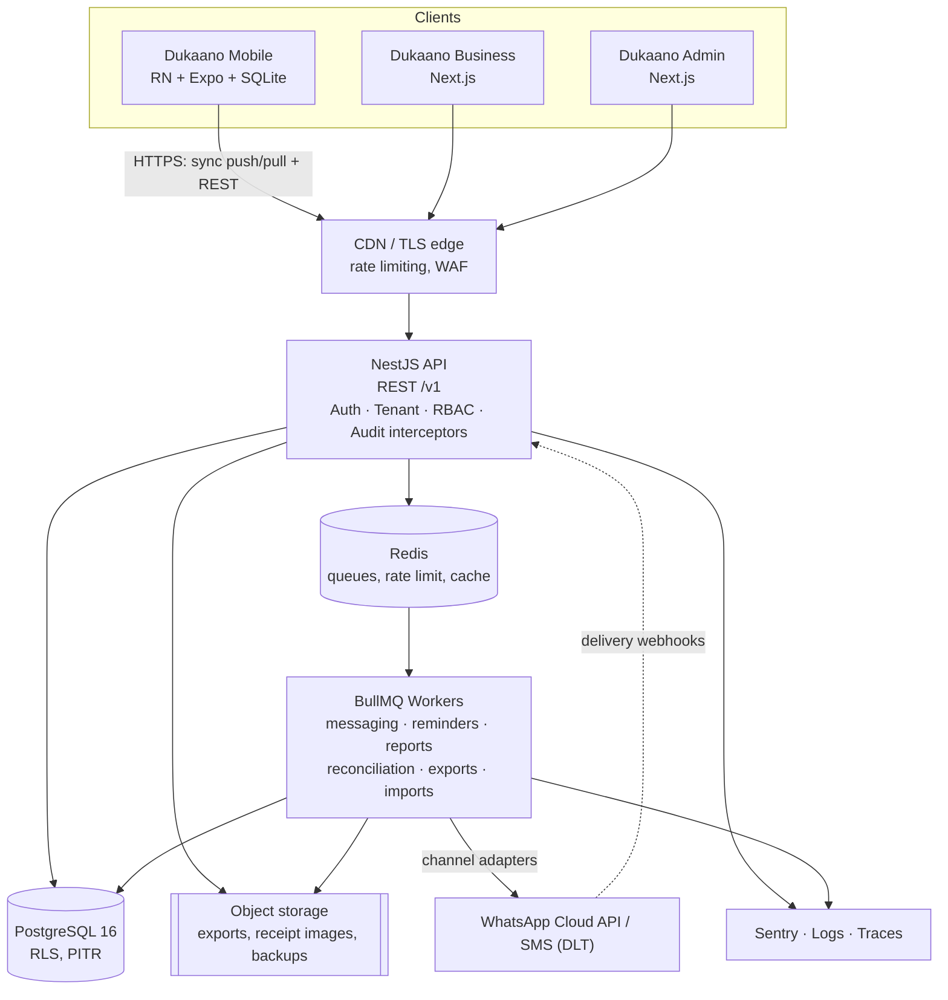
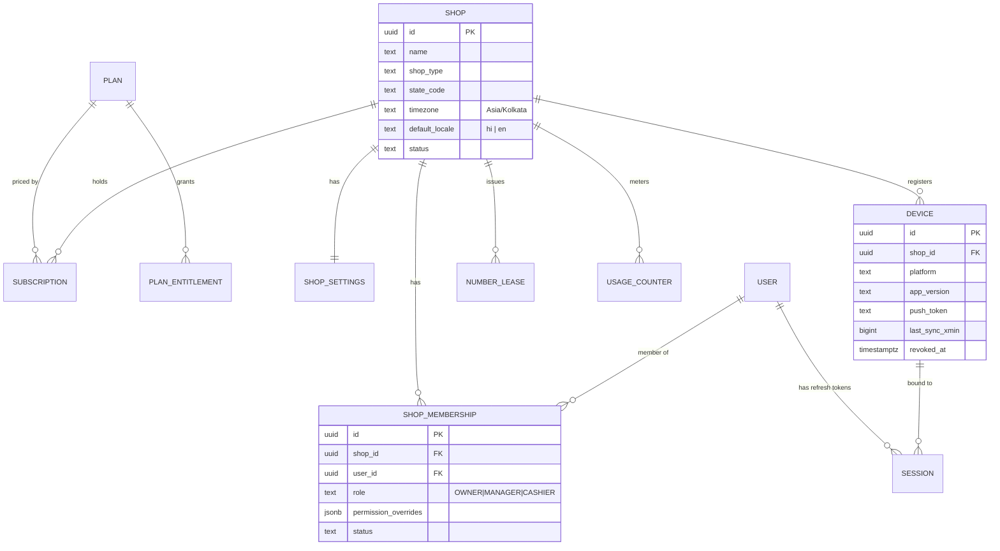
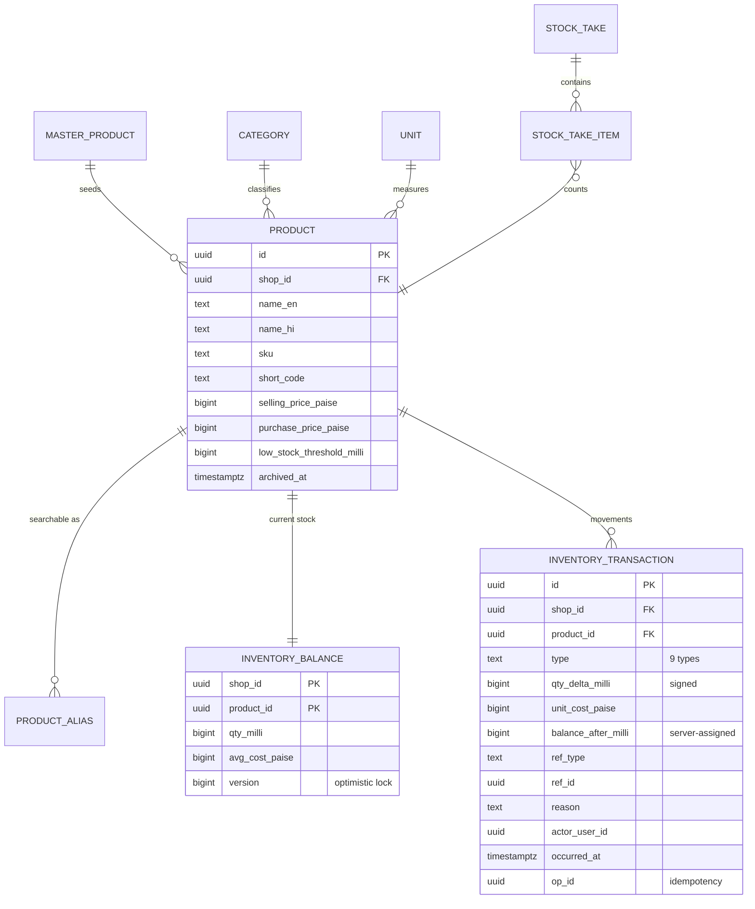
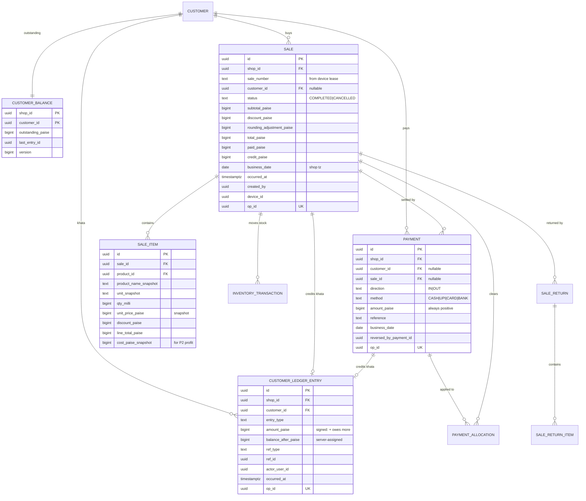

# Dukaano — Product & Engineering Blueprint

**Billing, Stock aur Khata — Sab Ek Jagah**

> Status: **Draft v1 — awaiting approval.** No application code is written yet.
> Owner: Ankit Dhadwal · Date: 2026-08-16 · Target market: India (pilot: Himachal Pradesh)

This document is the contract for everything that follows. Sections 1–10 define the product,
11–23 the architecture, 24–31 the execution plan. Sections marked **DECISION** are commitments
that code must not silently contradict; sections marked **ASSUMPTION** need your confirmation.

---

## Table of contents

| # | Section | # | Section |
|---|---|---|---|
| 1 | [Product summary](#1-product-summary) | 17 | [Inventory transaction model](#17-inventory-transaction-model) |
| 2 | [Target users](#2-target-users) | 18 | [Customer ledger model](#18-customer-ledger-model) |
| 3 | [Core value proposition](#3-core-value-proposition) | 19 | [Payment model](#19-payment-model) |
| 4 | [Feature hierarchy](#4-complete-feature-hierarchy) | 20 | [Messaging architecture](#20-messaging-architecture) |
| 5 | [MVP vs Phase 2](#5-mvp-vs-phase-2) | 21 | [API module structure](#21-api-module-structure) |
| 6 | [Mobile screen map](#6-mobile-app-screen-map) | 22 | [Localization strategy](#22-hindienglish-localization-strategy) |
| 7 | [Web admin screen map](#7-web-admin-screen-map) | 23 | [Security architecture](#23-security-architecture) |
| 8 | [Super Admin screen map](#8-super-admin-screen-map) | 24 | [Error-handling strategy](#24-error-handling-strategy) |
| 9 | [Roles and permissions](#9-user-roles-and-permissions) | 25 | [Edge-case analysis](#25-edge-case-analysis) |
| 10 | [Core user journeys](#10-core-user-journeys) | 26 | [Testing strategy](#26-testing-strategy) |
| 11 | [Technology stack](#11-recommended-technology-stack) | 27 | [Deployment architecture](#27-deployment-architecture) |
| 12 | [System architecture](#12-system-architecture) | 28 | [Development phases](#28-development-phases) |
| 13 | [Multi-tenancy strategy](#13-multi-tenancy-strategy) | 29 | [Monorepo structure](#29-recommended-monorepo-structure) |
| 14 | [Offline/sync architecture](#14-offlinesync-architecture) | 30 | [Risks and mitigation](#30-risks-and-mitigation) |
| 15 | [Database entities](#15-database-entities) | 31 | [Blocking questions](#31-blocking-questions-and-assumptions) |
| 16 | [Proposed ERD](#16-proposed-erd) | | |

---

## 1. Product summary

Dukaano is a bilingual (Hindi/English), offline-first operating system for small Indian retail
shops. It replaces the four artefacts that run a Kirana store today — the **bill book**, the
**stock register**, the **udhaar khata**, and the **shopkeeper's memory** — with one system that
works on a ₹8,000 Android phone in a village with two bars of signal.

Three surfaces, one backend:

| Product | Surface | Primary user | Primary job |
|---|---|---|---|
| **Dukaano Mobile** | React Native (Android-first) | Owner, Cashier | Bill a customer in under 20 seconds, offline |
| **Dukaano Business** | Next.js web admin | Owner, Manager | Bulk data entry, reports, settings, khata management |
| **Dukaano Admin** | Next.js super admin | Platform team (you) | Tenants, plans, master catalogue, messaging, support |

The core engineering thesis: **every money and stock number in the system is derived from an
append-only event log, never from a mutable counter.** That is what makes offline billing,
multi-device operation, refunds, and audit all fall out of one design instead of four.

### What Dukaano is not (in MVP)

Not an accounting package, not a GST filing tool, not a barcode-first POS, not an ERP.
Each of those is a deliberate exclusion recorded in §5. The product succeeds if a shopkeeper who
has never used software can bill their first customer within 15 minutes of installing it.

---

## 2. Target users

### 2.1 Segments (in launch order)

1. **Kirana / general store, single owner-operator, 1 counter.** 200–800 SKUs, ₹15k–₹60k daily
   turnover, 30–80% of regulars on udhaar. This is the beachhead.
2. **Kirana with 1–2 staff.** Owner needs to see what staff sold and collected. Introduces RBAC
   as a *paid* need, not a theoretical one.
3. **Village / small-town mini mart, mixed inventory.** Grocery + household + a little stationery.
   Validates that the catalogue model is not Kirana-only.
4. *(Phase 2)* Stationery, hardware, cosmetics, medical-adjacent general stores. The Dukaano brand
   is intentionally category-neutral so this expansion needs no rename.

### 2.2 Personas

**Rakesh, 46 — Owner, Sharma General Store, Solan (HP)**
Class 12 pass. WhatsApp-fluent, "app"-shy. Runs a 3-column bill book and a khata notebook with
~120 names. Biggest pain: at month end he cannot tell who owes what without reading 40 pages.
Second pain: he discovers Maggi is out of stock only when a customer asks. Uses a Redmi with 3GB
RAM and a 6.5" screen. Bills one-handed while his other hand bags items. **Will abandon any app
that takes more than ~4 taps to complete a cash sale.**

**Priya, 24 — Daughter / de-facto manager**
Comfortable with apps, does the "computer work". She is the one who will do bulk product entry on
a laptop, set prices, and read reports. **She is the reason the web admin exists.** She is also
the person who evaluates the product and convinces Rakesh — the buyer is the father, the champion
is the daughter. Onboarding must be designed for her, daily use for him.

**Sunil, 19 — Cashier**
Bills at the counter during rush hour. Must not see purchase prices or margins. Must not be able
to delete a sale. Must be able to take an udhaar payment if the owner allows it.

### 2.3 Operating constraints these personas impose

| Constraint | Design consequence |
|---|---|
| Many products have no barcode | Search-first billing; barcode is an accelerator, never a dependency |
| Signal drops for minutes-to-hours | Every billing action must complete with the radio off |
| ₹6k–₹12k Android, 2–4 GB RAM, Android 10+ | Virtualized lists, no heavy animation, SQLite over network for reads |
| Hindi is the comfortable language | Hindi is a first-class locale, not a translation afterthought |
| Cash-heavy, ad-hoc rounding | Bill-level round-off is a first-class field, not a UI hack |
| Shopkeeper's khata is *sacred* | Data loss is an existential product failure — §27, §30 |
| Cold-start data entry is the #1 churn cause | Master catalogue + add-during-billing + import + optional done-for-you entry |

---

## 3. Core value proposition

**"Aaj kitna bika, kiska kitna udhaar hai, aur kya khatam ho gaya — teeno ek screen par, bina internet ke."**
*(Today's sales, everyone's outstanding, and what's run out — all on one screen, without internet.)*

Ranked by what actually makes a shopkeeper pay:

1. **Khata that adds itself up.** The single highest-value replacement. Paper khata is the thing
   they *know* is costing them money.
2. **A bill in 20 seconds, offline.** If billing is slower than their bill book, nothing else matters.
3. **"Kya khatam ho gaya."** Low-stock visibility that prevents a lost sale.
4. **A WhatsApp reminder that gets money collected.** Measurable rupees recovered — the clearest ROI story.
5. **Owner sees the shop from home.** The staff-accountability wedge that upgrades Basic → Pro.

### Competitive honesty

This is a **crowded market**: Vyapar, myBillBook, Khatabook, OkCredit, Dukaan, Marg. We should not
pretend otherwise. Defensible wedges, in order of strength:

| Wedge | Why it holds |
|---|---|
| **Genuinely offline-first billing** | Most competitors degrade badly or block writes offline. This is expensive to retrofit — a real moat. |
| **Hindi-first, not Hindi-translated** | Including receipt templates, reports, error messages, and number formatting. |
| **One product, not billing + khata as two apps** | Khatabook/OkCredit do khata; Vyapar does billing. The join is the value. |
| **Ruthless simplicity ceiling** | We will decline features that break the 15-minute learning curve. That is a positioning choice, and it must be enforced in review. |
| **Regional, human, Hindi-speaking support** | Wins pilots in HP. Does not scale forever — see §30. |

---

## 4. Complete feature hierarchy

```
Dukaano
├── Identity & Tenancy
│   ├── Shop onboarding (name, type, address, state, timezone, language)
│   ├── Auth (phone + password; OTP in P2), refresh tokens, session revocation
│   ├── Shop membership, invites, roles (Owner/Manager/Cashier)
│   ├── Per-membership permission overrides
│   └── Device registry (name, platform, last sync, revoke)
├── Catalogue
│   ├── Categories (bilingual, from master or custom)
│   ├── Units (piece/packet/box/kg/g/L/mL/dozen/custom; decimal policy per unit)
│   ├── Products (bilingual names, SKU, short code, aliases, prices, thresholds)
│   ├── Master catalogue import ("add 40 common Kirana items in one tap")
│   ├── Quick-create during billing
│   ├── Bulk spreadsheet grid (web)
│   └── CSV/XLSX import with preview, mapping, validation, failed-row export
├── Inventory
│   ├── Append-only inventory transactions (9 types)
│   ├── Balance snapshot + moving average cost
│   ├── Manual adjustments with mandatory reason
│   ├── Low-stock thresholds, low-stock list, alerts
│   ├── Stock take / physical count reconciliation
│   └── Valuation report
├── Sales
│   ├── Search-first cart, decimal quantities, line + bill discounts
│   ├── Round-off to nearest ₹1/₹5 (configurable)
│   ├── Payments: Cash / UPI / Card / Split / Partial → remainder to Khata
│   ├── Held/parked bills
│   ├── Invoice numbering via device number leases (offline-safe)
│   ├── Cancellation (full reversal) and Returns (partial/full, own document)
│   └── Receipt share: WhatsApp deep link, image, print (P2)
├── Customers & Khata
│   ├── Customer registry with E.164 phone normalization + duplicate detection
│   ├── Append-only ledger + balance snapshot
│   ├── Receive payment (full/partial) with FIFO bill allocation
│   ├── Adjustments, write-offs, opening balances
│   ├── Statement generation & share
│   ├── Reminders (single + bulk), credit limits
│   └── Ageing buckets (0–30/31–60/61–90/90+)
├── Suppliers & Purchases
│   ├── Suppliers, purchase entry, cost capture → moving average update
│   ├── Purchase returns
│   └── Supplier outstanding ledger (P2)
├── Messaging
│   ├── Provider-agnostic channel abstraction (WhatsApp deep link / WA Cloud API / SMS)
│   ├── Bilingual templates with variable slots
│   ├── Outbox + worker + retries + delivery webhooks
│   └── Quota metering against plan
├── Reports  (see §4.1)
├── Notifications (in-app + push: low stock, sync failure, message failure, subscription)
├── Sync
│   ├── Client outbox, server idempotency ledger, delta pull, bootstrap snapshot
│   ├── Conflict policy per entity + conflict inbox
│   └── Sync health surfaced in UI (never silent)
├── Audit
│   └── Actor / action / entity / before / after / request-id on every sensitive mutation
└── SaaS
    ├── Plans, entitlements, subscriptions, trials, grace periods
    ├── Usage metering (messages, products, users, devices)
    ├── Feature flags (global / per-plan / per-shop)
    ├── Master catalogue management
    ├── Support tooling (shop timeline, audited impersonation)
    └── System health (queue depth, sync lag, error rate, DB)
```

### 4.1 Report inventory

| Report | MVP | Derived from |
|---|:--:|---|
| Today's sales (count, gross, by payment method) | ✅ | `sale`, `payment` |
| Daily / weekly / monthly sales trend | ✅ | `sale.business_date` |
| Sales by payment method (Cash / UPI / Card / Credit) | ✅ | `payment`, `sale.credit_paise` |
| Payments received (khata collections) | ✅ | `payment` direction=IN, no `sale_id` |
| Total outstanding + ageing buckets | ✅ | `customer_balance`, `customer_ledger_entry` |
| Best-selling products (qty & value) | ✅ | `sale_item` |
| Product-wise sales | ✅ | `sale_item` |
| Low stock | ✅ | `inventory_balance` vs `product.low_stock_threshold` |
| Inventory valuation (at moving avg cost) | ✅ | `inventory_balance.avg_cost_paise` |
| Staff-wise sales & collections | ✅ | `sale.created_by`, `payment.created_by` |
| Gross profit (sale price − snapshot cost) | ⬜ P2 | `sale_item.cost_paise_snapshot` — *field captured in MVP so the report is a query, not a migration* |
| Category profit | ⬜ P2 | same |
| Purchase vs sales | ⬜ P2 | `purchase`, `sale` |
| Dead stock / slow movers | ⬜ P2 | `inventory_transaction` recency |
| Supplier outstanding | ⬜ P2 | supplier ledger |

**DECISION:** MVP captures `cost_paise_snapshot` on every sale line even though the profit report
ships in P2. Profit is unrecoverable retroactively — capture now, report later.

---

## 5. MVP vs Phase 2

### 5.1 MVP — ships to paying pilot shops

Auth & shop onboarding · Roles (Owner/Manager/Cashier) · Products with bilingual names, SKU, short
code, aliases · Units with decimal quantities · Categories · Master catalogue seeding · Quick-create
during billing · Bulk grid + CSV/XLSX import · Append-only inventory with 9 transaction types ·
Low-stock thresholds and list · New Sale (search → cart → customer → payment) · Cash / UPI / Card /
Udhaar / Split / Partial · Bill round-off · Sale cancellation · Customers with phone normalization ·
Digital Khata with append-only ledger · Receive payment with FIFO allocation · Statement share ·
Reminder via WhatsApp deep link · Full English + Hindi across app, web, receipts, errors ·
Android app with SQLite offline billing · Bidirectional sync with idempotency and conflict policy ·
10 MVP reports · Dashboard · Audit log · In-app notifications · Super Admin (shops, users, plans,
subscriptions, master catalogue, messaging usage, feature flags, health).

### 5.2 Explicitly deferred to Phase 2+

| Deferred | Why it is safe to defer | Architecture hook kept in MVP |
|---|---|---|
| Barcode scanning | Target shops largely lack barcodes | `product.barcode` column + unique index, unused |
| GST invoicing & filing | Most target shops are below the registration threshold *(confirm HP threshold — §31)* | `tax_rate_bp`, `hsn_code`, `shop.gstin` columns, all default/null |
| Thermal Bluetooth printing | Share-to-WhatsApp covers the receipt need at ₹0 | Receipt render is a pure function → any renderer can consume it |
| WhatsApp Business Cloud API | Deep link works day one at zero cost & zero compliance | Channel adapter interface + `message` outbox already built |
| Multiple branches | Single-shop is the whole beachhead | `shop.parent_shop_id` nullable; tenancy key is already `shop_id` |
| Supplier outstanding ledger | Purchases are usually cash/short-credit | `purchase.paid_paise` captured; ledger tables mirror customer ledger |
| Demand forecasting / AI reorder | Needs ≥6 months of real data | `inventory_transaction` is the training set |
| Loyalty, e-commerce, customer app | Not a pain point yet | — |
| Returns *initiated by* customer app | — | `sale_return` document exists in MVP |
| FIFO/batch costing, expiry tracking | Moving average is adequate for grocery | costing is isolated behind one service |

**DECISION:** No Phase-2 item may block MVP. If a Phase-2 hook costs more than a nullable column
or an interface, it is dropped.

---

## 6. Mobile app screen map

Bottom navigation, five slots, with **Sale** as an elevated centre action. Optimized for right-thumb
reach on a 6.5" screen: primary actions live in the bottom third.

```
┌──────┬──────┬─────────┬───────┬──────┐
│ Home │ Stock│ ● SALE  │ Khata │ More │
└──────┴──────┴─────────┴───────┴──────┘
```

### Tab 1 — Home (`/(tabs)/index`)
Sync-status pill (Synced / N pending / Offline / Error → tappable). Four KPI tiles: Today's Sales,
Udhaar Today, Payments Received, Total Outstanding. Low-stock strip ("12 items khatam hone wale hain →").
Quick actions row: New Sale · Receive Payment · Add Product · Add Purchase. Recent activity feed
(last 10 sales/payments, each tappable). Pull-to-refresh triggers sync.

### Tab 2 — Stock (`/(tabs)/stock`)
Segmented filter: All · Low · Out · Category. Virtualized list: name (locale-aware), current qty +
unit, selling price, low-stock chip. Search bar pinned. FAB → Add Product.
- `stock/[id]` — Product detail: balance, price, threshold, last sold, **Adjust Stock**, **Edit**, transaction history (virtualized, paged).
- `stock/[id]/adjust` — signed quantity + mandatory reason (Damage / Wastage / Correction / Return / Other + note).
- `stock/new` — full product form.

### Tab 3 — Sale (the centre action) — **this is the product**
- `sale/new` — **Opens directly on a focused search field with the keyboard up.** No intermediate screen.
  - Below search: horizontally scrollable chips — Recent · Frequent · Favourites · Categories.
  - Each result row has a `+` that adds qty 1 in one tap; long-press or tap-row opens the qty pad.
  - Zero results → full-width **`+ नया प्रोडक्ट जोड़ें / Add New Product`**.
  - Sticky bottom bar: `3 items · ₹460 · [ आगे बढ़ें → ]`
- `sale/quick-product` — bottom sheet: Name*, Selling price*, Unit* (defaulted to `piece`). Collapsed "More": purchase price, opening stock, category, SKU. Saves and lands the item in the cart. **Never leaves the billing flow.**
- `sale/qty` — big numeric pad supporting decimals; unit-aware presets (kg → ¼ ½ 1 2 5; piece → 1 2 5 10); live line total.
- `sale/cart` — editable lines, per-line discount, bill discount (₹ or %), round-off toggle, running total.
- `sale/customer` — optional. Search by name/phone/last-4 · Recent customers · `+ New customer` (name + phone only). Shows current outstanding inline: *"पिछला बकाया ₹840"*.
- `sale/payment` — total in large type. Method tiles: **Cash · UPI · Card · Udhaar · Split**. Cash shows tender-amount shortcuts and computes change. Split opens per-method amount rows with a live "Remaining" figure; any remainder is explicitly labelled **"₹400 उधार खाते में जाएगा"** and requires a customer.
- `sale/success` — total, change due, invoice no. Actions: **Share on WhatsApp** · Share as image · New Sale · View bill. Auto-returns to a fresh sale after 8s (configurable).
- `sale/held` — parked bills list.

### Tab 4 — Khata (`/(tabs)/khata`)
Header: total outstanding + customer count. List sorted by outstanding desc, each row: name, phone,
₹ outstanding, days since last payment (red past 30). Filters: All · Overdue · Recently paid.
Bulk action: **Send reminders to all overdue**.
- `khata/[customerId]` — outstanding hero, ledger timeline (dated entries, running balance, tappable to source doc), actions: **Receive Payment** · Send Reminder · Share Statement · Adjustment (permissioned) · Edit.
- `khata/[customerId]/receive` — amount (with **Full ₹1,000** shortcut), method, date, note; preview of which bills it clears; new balance shown before confirm.
- `khata/[customerId]/statement` — date range → shareable text/image.
- `khata/new`

### Tab 5 — More
Sales history (filter by date/staff/method) → sale detail → Cancel / Return · Purchases · Suppliers ·
Reports · Customers · Notifications · Settings (Shop profile, Language, Receipt & messaging, Rounding
& stock policy, Devices, Sync) · Employees (Owner only) · Subscription · Help & support · Profile / Logout.

### Cross-cutting mobile states
Every screen defines: loading (skeleton, never a bare spinner), empty (illustration + one primary
action), error (plain-language cause + Retry), offline (banner, features that are unavailable are
*visibly disabled with a reason*, never silently broken).

---

## 7. Web admin screen map (Dukaano Business)

Left sidebar, collapsible, grouped. Responsive down to tablet; the web admin is a *management*
surface, and we do not pretend it is a POS (though `/sales/new` works on a laptop for shops with a
desktop counter).

```
Dashboard
Sales          → List · New Sale · Sale detail · Returns · Held bills
Products       → List · New · Edit · Bulk entry grid · Import · Export · Categories · Units · Master catalogue
Inventory      → Stock levels · Low stock · Adjustments · Transaction ledger · Stock take · Valuation
Customers      → List · Detail · Import · Duplicates review
Khata          → Outstanding · Ageing · Receive payment · Statements · Reminders (bulk)
Purchases      → List · New purchase · Detail · Purchase returns
Suppliers      → List · Detail
Reports        → 10 MVP reports, each with date range + CSV/XLSX export
Employees      → List · Invite · Role & permissions · Activity
Settings       → Shop profile · Language · Receipt & messaging · Templates · Rounding & stock policy
                 · Business day & timezone · Devices · Data export · Audit log · Danger zone
Subscription   → Plan, usage, invoices, upgrade
```

### Screens that earn their existence on web (not duplicated on mobile)

**Bulk entry grid** (`/products/bulk`) — a real spreadsheet: keyboard-navigable cells, paste from
Excel across a range, per-row inline validation, duplicate SKU highlighted live against existing
data, "add 20 more rows", save-all in one transactional batch with a per-row result summary.

**Import wizard** (`/products/import`) — 4 steps: Upload → Column mapping (auto-detected, with a
downloadable template) → Preview & validation (green/amber/red per row; duplicates flagged with the
existing product shown side-by-side and a per-row choice of Skip / Update / Create anyway) → Result
(N created, M updated, K failed + **Download failed rows** as a re-uploadable file).

**Inventory transaction ledger** (`/inventory/ledger`) — the audit view: every movement, filterable
by product/type/user/date, showing `balance_after`, reason, and a link to the source document.
This is the screen that proves to a shopkeeper the number is trustworthy.

**Ageing & bulk reminders** (`/khata/ageing`) — buckets, multi-select, one-click bulk reminder with
a per-customer preview and a quota check before sending.

**Audit log** (`/settings/audit`) — actor, action, entity, before/after diff, timestamp, source.

---

## 8. Super Admin screen map (Dukaano Admin)

Deployed as a **separate Next.js app on a separate hostname** (`admin.dukaano.in`) with its own auth
realm — see §23. There is no route in the shopkeeper app that can escalate into it.

```
Overview        → Shops (total/active/trial/churned), MRR, sales volume, sync lag, error rate, queue depth
Shops           → List (search, plan, status, last-active, health)
                  Detail → Profile · Users & devices · Subscription & invoices · Usage (products,
                           sales, messages, storage) · Sync health · Recent errors · Support notes
                           · Audited impersonation · Suspend / reactivate
Users           → Platform-wide user search, sessions, force logout, password reset
Plans           → Plans, entitlement matrix editor, pricing, trial length, grace period
Subscriptions   → Active / trialing / past-due / cancelled; manual overrides (audited)
Master Catalogue→ Categories · Products · Units · Bulk import · Publish/version · Per-shop adoption stats
Messaging       → Providers & credentials · Templates (per locale/channel) · Delivery stats
                  · Failure explorer · Usage & cost per shop
Feature Flags   → Global / per-plan / per-shop targeting, kill switches
Support         → Ticket queue, shop timeline (audited read-only event stream)
Audit           → Platform-level audit of every admin action
System Health   → API latency & error rate, BullMQ queues & DLQ, sync lag p50/p95,
                  DB connections & slow queries, background job failures
Announcements   → In-app broadcast to shops (by plan / region)
Settings        → Platform config, secrets rotation status, maintenance mode
```

**DECISION:** Super Admin and shop permissions live in **separate authorization systems**. A
`platform_admin` is not a `shop_membership` with extra flags. Impersonation issues a distinctly
scoped, short-lived, non-refreshable token that stamps `acting_as_admin_id` into every audit row,
and it is **read-only by default** — write impersonation is a separate, individually-granted
permission with a mandatory reason field.

---

## 9. User roles and permissions

### 9.1 Shop roles

| | Owner | Manager | Cashier |
|---|:--:|:--:|:--:|
| **Sales** |
| Create sale | ✅ | ✅ | ✅ |
| View own sales | ✅ | ✅ | ✅ |
| View all staff sales | ✅ | ✅ | ⬜ |
| Cancel sale | ✅ | ✅ | ⬜ |
| Create return | ✅ | ✅ | ⚙️ |
| Apply bill discount | ✅ | ✅ | ⚙️ (capped %) |
| **Products** |
| View products & selling price | ✅ | ✅ | ✅ |
| **View purchase price / margin** | ✅ | ✅ | ❌ |
| Create / edit product | ✅ | ✅ | ⚙️ (quick-create only) |
| Change selling price | ✅ | ✅ | ⬜ |
| Archive product | ✅ | ✅ | ⬜ |
| Bulk import | ✅ | ✅ | ⬜ |
| **Inventory** |
| View stock | ✅ | ✅ | ✅ |
| Manual adjustment | ✅ | ✅ | ⬜ |
| Stock take | ✅ | ✅ | ⬜ |
| **Customers & Khata** |
| View customers & balances | ✅ | ✅ | ✅ |
| Create / edit customer | ✅ | ✅ | ✅ |
| Sell on udhaar | ✅ | ✅ | ⚙️ |
| Receive payment | ✅ | ✅ | ⚙️ |
| Ledger adjustment / write-off | ✅ | ⬜ | ❌ |
| Send reminder | ✅ | ✅ | ⚙️ |
| Archive customer | ✅ | ⬜ | ❌ |
| **Purchases & Suppliers** | ✅ | ✅ | ❌ |
| **Reports** |
| Sales reports | ✅ | ✅ | ⬜ (own only) |
| Profit / margin reports | ✅ | ⚙️ | ❌ |
| **Administration** |
| Manage employees & roles | ✅ | ⬜ | ❌ |
| Shop settings | ✅ | ⬜ | ❌ |
| Messaging settings & templates | ✅ | ⬜ | ❌ |
| Subscription & billing | ✅ | ❌ | ❌ |
| Data export | ✅ | ⚙️ | ❌ |
| View audit log | ✅ | ⬜ | ❌ |
| Revoke devices | ✅ | ⬜ | ❌ |

✅ default on · ⬜ default off, Owner may grant · ⚙️ default off, grantable, commonly granted ·
❌ **not grantable at any role** (hard ceiling in code)

### 9.2 Implementation

**DECISION:** Roles are a **code-defined permission matrix**, not database rows. Rationale: three
roles, a fixed permission vocabulary, and a hard need for the matrix to be unit-testable and
reviewable in a diff. A DB-driven RBAC engine here is complexity without a customer.

```ts
// packages/business-logic/src/rbac/permissions.ts
export const PERMISSIONS = [
  'sale.create', 'sale.view.all', 'sale.cancel', 'sale.return', 'sale.discount',
  'product.view.cost', 'product.write', 'product.price.write', 'product.archive', 'product.import',
  'inventory.adjust', 'inventory.stocktake',
  'customer.write', 'customer.credit.sell', 'customer.payment.receive',
  'customer.ledger.adjust', 'customer.remind', 'customer.archive',
  'purchase.manage', 'supplier.manage',
  'report.sales', 'report.profit',
  'employee.manage', 'settings.manage', 'messaging.manage',
  'subscription.manage', 'data.export', 'audit.view', 'device.revoke',
] as const
export type Permission = typeof PERMISSIONS[number]

export const ROLE_DEFAULTS: Record<ShopRole, ReadonlySet<Permission>> = { /* ... */ }
/** Permissions a role may NEVER hold, even via override. Enforced server-side. */
export const ROLE_CEILING: Record<ShopRole, ReadonlySet<Permission>> = {
  CASHIER: new Set(['product.view.cost', 'customer.ledger.adjust', 'report.profit',
                    'employee.manage', 'settings.manage', 'subscription.manage',
                    'data.export', 'audit.view', 'device.revoke', 'customer.archive']),
  MANAGER: new Set(['subscription.manage']),
  OWNER:   new Set([]),
}
```

Effective permissions = `ROLE_DEFAULTS[role] ∪ grants − revokes − ROLE_CEILING[role]`, where grants
and revokes come from `shop_membership.permission_overrides`. The ceiling is applied **last and
server-side**, so a corrupted override can never escalate a Cashier.

Entitlements (plan features) are a **separate** check. `@RequirePermission('report.profit')` and
`@RequireEntitlement('advanced_reports')` are independent decorators; a request needs both.

---

## 10. Core user journeys

Each journey lists the happy path plus the failure branch that most commonly occurs in the field.

### J1 — New shop onboarding *(target: install → first bill in <15 min)*
Download → choose भाषा (Hindi default when device locale is `hi`) → enter phone → set password →
shop name, type, state, city (timezone defaults `Asia/Kolkata`) → **"Aapki dukaan mein kya bikta hai?"**
category multi-select → master catalogue shows ~40 pre-checked common items with editable prices →
**"Add all"** → shop has a working catalogue in ~90 seconds → guided first sale with a coach-mark
overlay → success screen offers "Add more products" / "Invite staff" / "Start billing".
*Failure branch:* no signal at signup → we require connectivity **only** for account creation, and
say so plainly; everything after works offline.

### J2 — Add first product
Stock → FAB → Name (EN and/or HI) → Unit → Selling price → *(optional)* purchase price, opening
stock, category, threshold, SKU/short code. Save → an `OPENING_STOCK` inventory transaction is
written if opening stock > 0. Never a bare balance write.

### J3 — Bulk import (web)
Priya downloads the template → fills 300 rows in Excel → upload → auto-mapped columns → preview
flags 12 duplicate SKUs and 3 invalid units → she resolves inline → import → 288 created, 12 updated,
0 failed. Every created product gets an `OPENING_STOCK` transaction. One `audit_log` row for the batch.

### J4 — Cash sale (the 20-second path)
Sale tab → type `sug` → tap `+` on Sugar Loose → qty pad `1.5` → done → `[आगे बढ़ें]` → skip customer
→ **Cash** → tender ₹100 → change ₹25 shown → Done. **Four taps + one number.**
Server-side, one transaction: `sale` + `sale_item[]` + `payment` + `inventory_transaction[]` +
`inventory_balance` update.

### J5 — UPI sale
Identical to J4 but method = UPI, with an optional reference field (never mandatory — the shopkeeper
is looking at their own PhonePe screen, not typing a UTR).
**DECISION (MVP):** UPI is *recorded*, not *collected*. Money lands in the shopkeeper's existing UPI
account. We do not touch a payment gateway, which avoids PA/PG licensing entirely. Dynamic UPI intent
QR generation is a P2 convenience, still non-custodial.

### J6 — Udhaar sale
Cart → **customer is now mandatory** → select Ramesh (shows *"पिछला बकाया ₹840"*) → method **Udhaar**
→ confirm. Writes: `sale` with `paid_paise = 0, credit_paise = 46000`, one
`customer_ledger_entry(SALE_CREDIT, +46000)`, `customer_balance` → ₹1,300.
Credit-limit check: if the new balance exceeds `credit_limit_paise`, warn with an override that is
permission-gated and audited. **Never a hard block** — the shopkeeper knows their customer.

### J7 — Partial payment (the ₹1,000 example)
Bill ₹1,000 → **Split** → UPI ₹600 → Remaining ₹400 → tap **"Baaki udhaar"** → customer required →
confirm. Writes, atomically: `sale(total=100000, paid=60000, credit=40000)`,
`payment(UPI, 60000, sale_id=…)`, `customer_ledger_entry(SALE_CREDIT, +40000)`, inventory movements.
The ₹400 is **not** a payment row. Only real money creates payment rows.

### J8 — Existing customer purchase
Search by last-4 (`8254` → Ramesh Sharma 98XXXX8254) → previous outstanding shown before payment
selection so the shopkeeper can ask for money at the right moment. This detail is worth real rupees
to the shop and should not be buried.

### J9 — New customer purchase
Inline in the cart flow: name + phone. Phone normalized to E.164; if it matches an existing customer,
we surface *"Ye customer pehle se hai — Ramesh Sharma, ₹840 baaki"* with a Use/Create-anyway choice.

### J10 — Receive udhaar payment
Khata → Ramesh (₹1,000) → Receive Payment → ₹300 (or **Full ₹1,000** shortcut) → Cash → preview
*"Clears: INV-0042 ₹300 of ₹460"* → confirm. Writes `payment(direction=IN, no sale_id)`,
`payment_allocation[]` (FIFO by default, manually overridable), `customer_ledger_entry(PAYMENT_RECEIVED, −30000)`.
New balance ₹700. Optional receipt message queued.

### J11 — Inventory adjustment
Stock → Sugar Loose → Adjust → `−2 kg` → reason **Damage** (mandatory) + note → confirm.
Writes `inventory_transaction(DAMAGE, −2000)` + balance update + `audit_log`. The old and new
balance are both shown before confirming.

### J12 — Supplier purchase
Purchases → New → Gupta Distributors → add lines (Maggi 100 pkt @ ₹11, Parle-G 200 @ ₹9, Tata Salt
50 @ ₹22) → invoice no. & date → paid/unpaid → Save. Writes `purchase` + `purchase_item[]` +
`inventory_transaction(PURCHASE, +qty, unit_cost)` per line + moving-average cost recomputation.
If a line's product doesn't exist, quick-create inline.

### J13 — Cancellation and refund
Sale detail → Cancel (permissioned) → mandatory reason → confirm. The sale is **not deleted**:
`status = CANCELLED`, and compensating entries are written — `inventory_transaction(SALE_CANCEL, +qty)`
per line, `customer_ledger_entry(SALE_CANCELLED, −credit)` if it was on credit, and a
`payment(direction=OUT, method=CASH, reason=REFUND)` for money actually returned.
**Partial return** creates a `sale_return` document instead, with its own items — never an edit of
the original sale.

### J14 — Offline sale
Airplane mode. Search hits SQLite FTS5. Sale completes in the same time as online. Local stock
decrements. Invoice number is drawn from the device's pre-leased number block, so the printed/shared
number is final. Sync pill shows **"1 pending"**. Ledger and balances update locally.

### J15 — Sync after reconnecting
Connectivity returns → outbox flushes in creation order → per-op results returned → applied ops are
dropped from the outbox → delta pull applies server changes → local balances are **replaced by
server-computed values** (server is authoritative for derived state) → pill returns to **Synced**.
If an op is rejected, it moves to a **Conflict inbox** with a plain-language explanation and a
Retry / Discard choice. Nothing is ever discarded silently.

---

## 11. Recommended technology stack

| Layer | Choice | Justification / rejected alternative |
|---|---|---|
| Monorepo | **pnpm workspaces + Turborepo** | Fast, low-config, good RN support. *Rejected Nx:* heavier than needed for 3 apps. |
| Language | **TypeScript, `strict: true`** everywhere | Shared money/ledger types between server and mobile is the single biggest bug-prevention lever. |
| API | **NestJS 11** | Modules, DI, guards, interceptors map exactly onto tenancy + RBAC + audit as cross-cutting concerns. |
| ORM | **Prisma 6** | Type safety, migrations. *Caveat:* raw SQL used deliberately for search, reports, and `FOR UPDATE` locks — accepted and isolated in repository classes. |
| DB | **PostgreSQL 16** | `pg_trgm`, `unaccent`, partial & composite indexes, RLS, generated columns, `xid8`. |
| Cache/queue | **Redis 7 + BullMQ** | Messaging outbox, reports, reminders, reconciliation, exports. |
| Web | **Next.js 15 (App Router) + Tailwind + shadcn/ui + TanStack Query + react-hook-form + Zod** | Server components for report pages, client islands for the grid. |
| Mobile | **React Native + Expo (SDK 54+), dev client** | *Not Expo Go* — we need custom native modules (SQLite, secure store, background sync). Expo's OTA updates matter for pushing fixes to shops with no Play Store literacy. |
| Mobile routing | **Expo Router** | File-based, matches the web mental model. |
| Mobile server state | **TanStack Query** with a SQLite persister | Cache is durable across cold starts. |
| Mobile client state | **Zustand** | Cart, session, sync status. |
| Mobile local DB | **expo-sqlite + Drizzle ORM** | Prisma has no RN runtime. Drizzle gives typed SQL over SQLite and *shares its schema definition style* with the server. **FTS5** for product/customer search. |
| Validation | **Zod**, schemas in `packages/validation`, shared by API DTOs, web forms, and mobile forms | One definition of "valid product" for all three surfaces. |
| i18n | **i18next** + `react-i18next` / `expo-localization`; ICU plurals | Same catalogue format on web and mobile; server-side rendering for receipts/messages. |
| Money | **Custom `@dukaano/money`** using `bigint` internally | See §25/§15. No `Decimal.js` on the wire. |
| Auth | **Custom, argon2id + rotating refresh tokens** | *Rejected Auth0/Clerk:* phone-first Indian auth, offline session semantics, and cost per MAU at ₹299/mo pricing make hosted auth a poor fit. |
| Testing | **Vitest** (unit), **Jest + Supertest + Testcontainers** (integration), **Playwright** (web E2E), **Maestro** (mobile E2E), **k6** (load) | Testcontainers gives a real Postgres per suite — essential for RLS and lock-based logic. |
| Observability | **Sentry** (all 3 apps), **Pino → Better Stack**, **OpenTelemetry** traces | — |
| CI/CD | **GitHub Actions**, **EAS Build** for Android | — |

**Library additions require justification in the PR.** Anything that touches money, dates, or
inventory must be reviewed against the money/quantity DECISIONs in §15.

---

## 12. System architecture



### Request pipeline (NestJS, in order)

```
RequestId → RateLimit → JWT Auth → ShopContext (resolve shop_id from token + header)
  → TenantTransaction (BEGIN; SET LOCAL app.shop_id) → Entitlement guard → Permission guard
  → Zod DTO validation → Idempotency (for writes) → Controller → Domain service
  → Audit interceptor → COMMIT → Response envelope
```

Two rules that this pipeline exists to enforce:
1. **No repository method can be called outside a tenant-scoped transaction.** Enforced by a Prisma
   client extension that throws if `app.shop_id` is unset on a tenant table query.
2. **Every write that changes money or stock passes through a domain service**, never a controller.
   Controllers do HTTP; services do business rules; repositories do SQL.

---

## 13. Multi-tenancy strategy

**DECISION: Shared database, shared schema, `shop_id` on every tenant-owned table, enforced in
three independent layers.** Schema-per-tenant and DB-per-tenant are rejected — at the target price
point (₹0–₹599/mo) and expected tenant count (10k+), per-tenant migrations and connection
management would dominate engineering cost.

### Layer 1 — Application (fast, developer-facing)
`ShopContextGuard` resolves `shop_id` from the JWT's active membership. A Prisma extension injects
`shop_id` into `where` for every tenant model and **throws** if a query on a tenant model runs
without a resolved shop context. This catches ~99% of mistakes at test time.

### Layer 2 — Database (Row-Level Security; the real boundary)
```sql
ALTER TABLE product ENABLE ROW LEVEL SECURITY;
ALTER TABLE product FORCE ROW LEVEL SECURITY;
CREATE POLICY tenant_isolation ON product
  USING      (shop_id = current_setting('app.shop_id', true)::uuid)
  WITH CHECK (shop_id = current_setting('app.shop_id', true)::uuid);
```
Set per request inside the transaction: `SET LOCAL app.shop_id = $1`.
The API connects as a role **without** `BYPASSRLS`. Super Admin queries use a *second* connection
pool with a distinct role that has `BYPASSRLS`, reachable only from the admin module. A shop-facing
code path physically cannot read another tenant's rows even with a SQL injection in a `where` clause.

> **Pooling caveat, recorded now to prevent a production incident:** `SET LOCAL` only survives in
> **transaction-mode** pooling. If PgBouncer is introduced, it must be transaction mode, and every
> tenant query must already be inside a transaction — which the pipeline guarantees.

### Layer 3 — Referential (structural)
Cross-tenant foreign-key stitching is made *impossible*, not merely unlikely:
```sql
ALTER TABLE product ADD CONSTRAINT product_shop_id_uq UNIQUE (shop_id, id);
ALTER TABLE sale_item
  ADD CONSTRAINT sale_item_product_fk
  FOREIGN KEY (shop_id, product_id) REFERENCES product (shop_id, id);
```
A `sale_item` in Shop A cannot reference a product in Shop B even if application code tries.
This pattern is applied to every parent→child tenant relationship.

### Testing the boundary
A dedicated `tenant-isolation.spec.ts` seeds two shops and asserts that *every* API route returns
404 (never 403 — no existence leak) for a foreign resource id. It is generated from the route table,
so a new endpoint that forgets tenancy **fails CI**.

### Platform-level (non-tenant) tables
`plan`, `master_category`, `master_product`, `unit_definition`, `feature_flag`, `platform_user`,
`platform_audit_log` — no `shop_id`, no RLS, read-only to shop-facing code.

---

## 14. Offline/sync architecture

This is the hardest part of the system, so it is specified before it is built.

### 14.1 The founding insight

Almost everything a shopkeeper does offline is an **append of an immutable fact**: a sale happened,
a payment was received, stock was damaged. Facts do not conflict — two facts are simply two facts.
Only a small set of things are **mutable state**: product name/price, customer details, settings.

**DECISION: Financial and inventory data is modelled as an append-only event log.** This reduces
the offline conflict problem from "merge two versions of the truth" to "insert two events
idempotently, then recompute derived state on the server." Balances are never synced as values —
they are always recomputed server-side and pushed down as read-only.

### 14.2 What is authoritative

| Data | Authority | Rule |
|---|---|---|
| Sale, payment, ledger entry, inventory transaction (the *fact* it happened) | **Client** | Server never rejects a well-formed, authorized financial event created offline. It may flag it. |
| `balance_after`, `inventory_balance`, `customer_balance`, `avg_cost` (*derived state*) | **Server** | Client values are optimistic and are overwritten on pull. |
| Product/customer/supplier fields (*mutable state*) | **Server**, LWW with conflict record | See 14.5. |
| Invoice numbers | **Server**, pre-leased to devices | See 14.6. |
| Roles, permissions, entitlements, subscription | **Server**, always | Re-evaluated at push time. |
| Shop settings | **Server** | Client is a cache. |

### 14.3 Client-side model

Every syncable row on the device carries: `id` (UUIDv7, client-generated — time-ordered so SQLite
B-tree inserts stay sequential), `client_created_at`, `client_updated_at`, `server_row_version`,
`sync_state` (`local` | `pending` | `synced` | `conflict`), `device_id`.

The outbox:
```sql
CREATE TABLE sync_outbox (
  op_id        TEXT PRIMARY KEY,   -- UUIDv7, THE idempotency key
  seq          INTEGER,            -- device-local monotonic ordering
  entity       TEXT NOT NULL,      -- 'sale' | 'payment' | 'product' | ...
  entity_id    TEXT NOT NULL,
  op_type      TEXT NOT NULL,      -- 'create' | 'update' | 'archive'
  base_version INTEGER,            -- server_row_version the edit was made against (updates only)
  payload      TEXT NOT NULL,      -- JSON
  attempts     INTEGER DEFAULT 0,
  last_error   TEXT,
  next_retry_at INTEGER,
  created_at   INTEGER NOT NULL
);
```
The outbox is written **in the same SQLite transaction** as the local domain rows. There is no
window in which a sale exists locally but is not queued.

Ordering: ops flush in `seq` order and stop at the first hard failure for that *entity chain*, so a
payment can never be applied before the sale it references. Independent entity chains continue.

### 14.4 Push protocol

```http
POST /v1/sync/push
Idempotency-Key: <batch-uuid>
{
  "device_id": "…", "client_time": "2026-08-16T09:31:04.221Z", "app_version": "1.4.0",
  "ops": [
    { "op_id": "018f…", "seq": 412, "entity": "sale", "op_type": "create",
      "id": "018f…", "payload": { … } }
  ]
}
```
```jsonc
// 200 OK — always 200; per-op status inside. Batch is NOT atomic; each op is.
{
  "server_time": "…",
  "results": [
    { "op_id": "018f…", "status": "applied",   "row_version": 7, "server_entity": { … } },
    { "op_id": "018e…", "status": "duplicate", "row_version": 3 },
    { "op_id": "018d…", "status": "conflict",  "server_entity": { … }, "resolution": "server_wins" },
    { "op_id": "018c…", "status": "rejected",  "code": "PERMISSION_REVOKED", "message_key": "sync.err.permission" }
  ],
  "cursor": "…"
}
```

Server handling of each op, inside its own transaction:
1. `INSERT INTO processed_operation (op_id, …) ON CONFLICT DO NOTHING`. If no row inserted → the op
   already ran; return the **stored original result**. This is the entire duplicate-sale defence.
2. Re-authorize against **current** server permissions (§25 E-31 for the nuance).
3. Validate with the same Zod schema the client used.
4. Apply through the normal domain service — *the same code path as an online write*. There is no
   parallel "sync writer" that could drift from online behaviour. This is a hard rule.
5. Record the result in `processed_operation` (90-day TTL, then pruned; ops older than that cannot
   be replayed, which is safe because the device would have been forced into a bootstrap by then).

### 14.5 Pull protocol and cursor correctness

Every tenant write appends to `change_log` **in the same transaction**:
```sql
CREATE TABLE change_log (
  id          BIGSERIAL PRIMARY KEY,
  shop_id     UUID NOT NULL,
  entity      TEXT NOT NULL,
  entity_id   UUID NOT NULL,
  op          TEXT NOT NULL,          -- upsert | archive
  row_version BIGINT NOT NULL,
  txid        XID8 NOT NULL DEFAULT pg_current_xact_id(),
  changed_at  TIMESTAMPTZ NOT NULL DEFAULT now()
);
CREATE INDEX ON change_log (shop_id, txid, id);
```

> **The subtle bug this avoids.** `BIGSERIAL` is allocated at INSERT but rows become visible at
> COMMIT. A transaction that grabs id 100 can commit *after* one that grabbed id 105. A cursor
> based on `id` alone would serve 105, advance past it, and **permanently lose row 100** — a
> silently missing sale on a device. This class of bug is nearly impossible to reproduce in testing
> and catastrophic in production.

The cursor is therefore an **xmin watermark**, not an id:
```sql
SELECT * FROM change_log
WHERE shop_id = $1
  AND txid >= $cursor_xmin
  AND txid <  pg_snapshot_xmin(pg_current_snapshot())  -- exclude anything possibly in-flight
ORDER BY txid, id
LIMIT $n;
```
The next cursor is the new `pg_snapshot_xmin`. Rows at exactly `cursor_xmin` may be re-served; the
client's apply step is an idempotent upsert keyed by `(entity, id, row_version)`, so overlap is
free. `xid8` is 64-bit and wraparound-safe.

**Bootstrap.** `GET /v1/sync/bootstrap` returns a gzipped full dataset (products, balances,
customers, balances, settings, open ledger) plus a cursor. Used on first login, on a new device, or
when `cursor_xmin` predates `change_log` retention (30 days) — in which case pull returns
`{"snapshot_required": true}`.

### 14.6 Invoice numbers offline

An offline device cannot call a server sequence, but a receipt handed to a customer must carry a
final number. **DECISION: number leases.**
```
number_lease(shop_id, device_id, series, range_from, range_to, issued_at, exhausted_at)
```
A device holds a block of e.g. 200 numbers and requests a new lease when fewer than 20 remain.
Numbers are unique per shop and monotonic per device. **Gaps are expected and acceptable** — the
web admin explains this once ("kuch numbers chhoot sakte hain, ye normal hai"). The alternative
(server-assigned numbers) would mean the customer's copy and the system's record disagree, which
is far worse.

### 14.7 Conflict policy — per entity

| Entity | Policy | Detail |
|---|---|---|
| `sale`, `sale_item`, `sale_return` | **Append-only, idempotent** | No conflict possible. Cancellation is a separate op on the server-side record. |
| `payment`, `payment_allocation` | **Append-only, idempotent** | Two offline payments from two devices both apply; balance is the sum. Correct — both cash amounts were really received. |
| `customer_ledger_entry` | **Append-only**; `balance_after` **server-assigned at apply time** | Server order = arrival order, not client order. Statement ordering uses `occurred_at`, running balance uses server sequence. |
| `inventory_transaction` | **Append-only**; `balance_after` server-assigned | See below — the negative-stock decision. |
| `product` | **Field-aware LWW.** `selling_price` and `purchase_price` are **server-wins** unless the client edit is strictly newer than the server's *and* was made against the current `row_version`. All other fields: last-write-wins by `client_updated_at`, ties broken by server time. Every override writes a `sync_conflict` row. | Prices are the only field where a stale offline overwrite is financially harmful, so they get the stricter rule. |
| `customer`, `supplier` | LWW by `client_updated_at` + `sync_conflict` record | Low harm. |
| `shop_settings`, `product` archive-status | **Server always wins** | Client refetches. |
| `shop_membership` / permissions | **Server always wins**, re-evaluated at push | §25 E-31. |
| `inventory_balance`, `customer_balance` | **Never synced upward.** Pull-only. | Derived state. |

### 14.8 The two-cashiers-offline case — stated explicitly

Two devices are offline. Stock of Sugar = 5 kg. Device A sells 3 kg; Device B sells 3 kg. Both sync.

**Decision: both sales are accepted. Stock becomes −1 kg.** The system then:
- stamps both sales `has_negative_stock = false` (neither was negative when created) and stamps the
  resulting balance as negative,
- raises a **Stock Mismatch** notification naming the product and the two sales,
- offers a one-tap **Stock Correction** flow that writes a `CORRECTION` transaction with reason
  "sync mismatch".

Rejecting the second sale would be **wrong**: 3 kg of sugar physically left the shop and ₹150
physically entered the till. Refusing to record it destroys financial truth to protect a stock
number. Financial correctness outranks inventory correctness — this is the ordering in your §54,
and this is where it bites.

### 14.9 Sync scheduling & UX
Triggers: app foreground, connectivity regained, after any local mutation (debounced 3 s), every
5 min in foreground, `expo-background-task` when backgrounded, manual pull-to-refresh.
Backoff: 1 s → 2 s → 5 s → 15 s → 60 s → 5 min, capped, with jitter.
Batch size 100 ops or 512 KB, gzip both directions.
**The sync state is always visible and never lies.** "Synced" appears only when the outbox is empty
and the last pull succeeded. A failed sync is a persistent, tappable banner — not a toast.

---

## 15. Database entities

### 15.1 Money and quantity — the two most important decisions

**DECISION — Money: 64-bit integer paise (`BIGINT`), everywhere.** No `float`, no `numeric`, no
`Decimal` on the wire. Column names end in `_paise` so a review can spot a unit error visually.
JSON carries plain integers (safe: ₹90,00,00,00,000 is well inside `Number.MAX_SAFE_INTEGER`).
All arithmetic goes through `@dukaano/money`, which uses `bigint` internally so that intermediate
products cannot overflow the double-precision safe range.

**DECISION — Quantity: 64-bit integer milli-units (`BIGINT`), scale 10⁻³.** `1.25 kg → 1250`,
`750 g → 750` (when the product's unit is kg), `2.5 L → 2500`. Three decimals covers grams and
millilitres, which is the finest granularity any Kirana shop transacts in. Column names end in
`_milli`.
*Why not `NUMERIC`:* SQLite has no decimal type. If the mobile app computes in `REAL` and the server
in `NUMERIC`, the two will drift and every reconciliation will show phantom mismatches. **Integer
scaling is the only representation that is bit-identical on both platforms.**

**DECISION — Rounding: half-up, applied once, at the line level.**
```ts
// packages/money/src/line.ts
export function lineTotal(unitPricePaise: number, qtyMilli: number): number {
  const p = BigInt(unitPricePaise) * BigInt(qtyMilli)     // exact
  return Number((p + 500n) / 1000n)                        // half-up (qty is non-negative)
}
```
`subtotal = Σ lineTotal` (no re-rounding). Bill discount applied to the subtotal, then
`rounding_adjustment_paise` (India-specific, configurable: none / nearest ₹1 / nearest ₹5) produces
`total_paise`. The adjustment is a **stored field**, never an implicit UI truncation, so the bill
always reconciles: `Σ lines − discount + rounding = total`. An integration test asserts that
identity on every sale.

**Unit price granularity:** integer paise per unit. A shop needing sub-paise granularity per gram
prices per kg instead. *(ASSUMPTION — see §31.)*

### 15.2 Entity catalogue

**Platform (no `shop_id`, no RLS)**
`plan` · `plan_entitlement` · `master_category` · `master_product` · `unit_definition` ·
`feature_flag` · `platform_user` · `platform_session` · `platform_audit_log`

**Identity & tenancy**
`shop` · `shop_settings` · `user` · `shop_membership` · `session` (refresh tokens) · `device` ·
`number_lease` · `subscription` · `subscription_event` · `usage_counter`

**Catalogue**
`category` · `unit` · `product` · `product_alias`

**Inventory**
`inventory_transaction` (append-only) · `inventory_balance` (snapshot) · `stock_take` · `stock_take_item`

**Sales**
`sale` · `sale_item` · `sale_return` · `sale_return_item`

**Money**
`payment` · `payment_allocation`

**Customers**
`customer` · `customer_ledger_entry` (append-only) · `customer_balance` (snapshot)

**Supply**
`supplier` · `purchase` · `purchase_item` · `purchase_return` · `purchase_return_item`

**Messaging**
`message_template` · `message` (outbox) · `message_event`

**Sync & ops**
`change_log` · `processed_operation` · `sync_conflict` · `notification` · `audit_log` ·
`import_batch` · `import_row_error`

### 15.3 Key column, constraint and index decisions

```sql
-- Products: bilingual, searchable, tenant-safe
CREATE TABLE product (
  id                       UUID PRIMARY KEY,             -- UUIDv7, client-generatable
  shop_id                  UUID NOT NULL REFERENCES shop(id),
  master_product_id        UUID REFERENCES master_product(id),
  name_en                  TEXT,
  name_hi                  TEXT,
  sku                      TEXT,
  short_code               TEXT,
  barcode                  TEXT,                          -- P2, indexed now
  category_id              UUID,
  unit_id                  UUID NOT NULL,
  selling_price_paise      BIGINT NOT NULL CHECK (selling_price_paise >= 0),
  purchase_price_paise     BIGINT CHECK (purchase_price_paise >= 0),
  mrp_paise                BIGINT,
  low_stock_threshold_milli BIGINT NOT NULL DEFAULT 0,
  tax_rate_bp              INTEGER NOT NULL DEFAULT 0,    -- basis points, P2 GST
  hsn_code                 TEXT,
  is_active                BOOLEAN NOT NULL DEFAULT TRUE,
  archived_at              TIMESTAMPTZ,
  search_text              TEXT GENERATED ALWAYS AS (
                             lower(coalesce(name_en,'') || ' ' || coalesce(name_hi,'') || ' ' ||
                                   coalesce(sku,'')    || ' ' || coalesce(short_code,''))
                           ) STORED,
  row_version              BIGINT NOT NULL DEFAULT 1,
  created_by               UUID, updated_by UUID,
  client_updated_at        TIMESTAMPTZ,
  created_at               TIMESTAMPTZ NOT NULL DEFAULT now(),
  updated_at               TIMESTAMPTZ NOT NULL DEFAULT now(),
  CHECK (name_en IS NOT NULL OR name_hi IS NOT NULL),
  UNIQUE (shop_id, id)                                    -- enables composite FKs (§13)
);

CREATE UNIQUE INDEX product_sku_uq   ON product (shop_id, lower(sku))
  WHERE sku IS NOT NULL AND archived_at IS NULL;
CREATE UNIQUE INDEX product_code_uq  ON product (shop_id, lower(short_code))
  WHERE short_code IS NOT NULL AND archived_at IS NULL;
CREATE INDEX product_search_trgm ON product USING GIN (search_text gin_trgm_ops);
CREATE INDEX product_active      ON product (shop_id, is_active) WHERE archived_at IS NULL;
```
Note the **partial unique indexes**: SKU uniqueness is scoped to the shop *and* excludes archived
products, so a shop may reuse a SKU after archiving, and two shops may both use `SUG01`.

```sql
-- Customer phone: normalized, tenant-unique, last-4 searchable
ALTER TABLE customer
  ADD COLUMN phone_e164 TEXT,                              -- '+919876548254'
  ADD COLUMN phone_last4 TEXT GENERATED ALWAYS AS (right(phone_e164, 4)) STORED;
CREATE UNIQUE INDEX customer_phone_uq ON customer (shop_id, phone_e164)
  WHERE phone_e164 IS NOT NULL AND archived_at IS NULL;
CREATE INDEX customer_last4 ON customer (shop_id, phone_last4);
CREATE INDEX customer_name_trgm ON customer USING GIN (lower(name) gin_trgm_ops);
```

**Index set driven by the actual query plan** (each is justified by a named screen):
| Index | Serves |
|---|---|
| `product (shop_id, is_active) WHERE archived_at IS NULL` | product list, sync bootstrap |
| `GIN(search_text gin_trgm_ops)` | billing search (`sug` → Sugar…) |
| `sale (shop_id, business_date DESC)` | Today's sales, daily/monthly reports |
| `sale (shop_id, customer_id, occurred_at DESC)` | customer purchase history |
| `sale (shop_id, created_by, business_date)` | staff-wise report |
| `sale_item (shop_id, product_id, sale_id)` | product-wise sales, best sellers |
| `inventory_transaction (shop_id, product_id, occurred_at DESC, id)` | product stock history |
| `customer_ledger_entry (shop_id, customer_id, occurred_at DESC, id)` | khata timeline, statement |
| `customer_balance (shop_id, outstanding_paise DESC) WHERE outstanding_paise > 0` | khata list, ageing |
| `payment (shop_id, business_date, method)` | collections & method split |
| `change_log (shop_id, txid, id)` | sync pull |
| `message (status, next_retry_at) WHERE status IN ('QUEUED','FAILED')` | outbox worker |
| `audit_log (shop_id, created_at DESC)` — **partitioned monthly** | audit screen; keeps the hot table small |

**Soft delete:** `archived_at TIMESTAMPTZ` on `product`, `customer`, `supplier`, `category`.
**Financial documents are never soft-deleted** — `sale`, `payment`, `*_ledger_entry`,
`inventory_transaction` have no delete path at all. `sale` has `status = CANCELLED` and compensating
entries; there is no `DELETE` grant on those tables for the application role.

---

## 16. Proposed ERD

### 16.1 Identity, tenancy, subscription



### 16.2 Catalogue and inventory



### 16.3 Sales, payments and the customer ledger — *the financial core*



### 16.4 Relationship rules worth stating in prose

- A `sale` **may** have no customer (walk-in cash). It **must** have a customer if `credit_paise > 0`.
  Enforced by a DB `CHECK` *and* a service assertion.
- `sale.paid_paise` is defined as `Σ payment.amount_paise WHERE sale_id = sale.id AND direction='IN'`
  minus refunds. It is a maintained snapshot, and a nightly reconciliation job asserts equality.
- A `payment` with `sale_id = NULL` and `customer_id != NULL` is a **khata collection** and is
  allocated to bills via `payment_allocation`. This is the only correct way to answer "which bills
  did this ₹300 clear?".
- `customer_ledger_entry` is the **only** writer of `customer_balance`. Nothing else touches it.
- `inventory_transaction` is the **only** writer of `inventory_balance`.
- Every entity that can be created offline carries a unique `op_id`.

---

## 17. Inventory transaction model

### 17.1 Transaction types

| Type | Sign | Source | Cost captured |
|---|:--:|---|:--:|
| `OPENING_STOCK` | + | product create / import | ✅ (purchase price) |
| `PURCHASE` | + | supplier purchase | ✅ |
| `SALE` | − | sale item | — |
| `SALE_CANCEL` | + | sale cancellation | — |
| `CUSTOMER_RETURN` | + | sale return | — |
| `SUPPLIER_RETURN` | − | purchase return | ✅ |
| `DAMAGE` | − | manual, reason required | — |
| `WASTAGE` | − | manual, reason required | — |
| `ADJUSTMENT` | ± | manual, reason required | — |
| `CORRECTION` | ± | stock take / sync mismatch | — |

### 17.2 The write path (this exact sequence, always)

```ts
// Inside the request transaction, once per product touched.
async function applyMovement(tx, { shopId, productId, deltaMilli, unitCostPaise, ref, actor }) {
  // 1. Lock the balance row. Deterministic lock order (product_id ASC) prevents deadlocks
  //    when a multi-line sale touches the same products as a concurrent sale.
  const bal = await tx.$queryRaw`
    SELECT qty_milli, avg_cost_paise, version FROM inventory_balance
    WHERE shop_id = ${shopId} AND product_id = ${productId} FOR UPDATE`

  const after = bal.qty_milli + deltaMilli

  // 2. Moving-average cost — only inbound movements with a known cost change it.
  const nextAvg = deltaMilli > 0 && unitCostPaise != null
    ? movingAverage(bal.qty_milli, bal.avg_cost_paise, deltaMilli, unitCostPaise)
    : bal.avg_cost_paise

  // 3. Append the immutable fact, stamping the resulting balance.
  await tx.inventoryTransaction.create({ data: { …, qtyDeltaMilli: deltaMilli,
                                                 balanceAfterMilli: after, unitCostPaise } })

  // 4. Update the snapshot.
  await tx.inventoryBalance.update({ where: { shopId_productId }, data: {
    qtyMilli: after, avgCostPaise: nextAvg, version: bal.version + 1n } })

  // 5. Low-stock crossing → enqueue notification (never inline, never blocking).
  if (crossedBelowThreshold(bal.qty_milli, after, threshold)) enqueueLowStock(productId)
}
```

`movingAverage` guards the degenerate cases: when `qty <= 0` before an inbound movement, the new
average is simply the incoming unit cost (you cannot average against negative stock meaningfully).
This is unit-tested with the negative-stock case explicitly.

**Deadlock avoidance:** a multi-line sale sorts its product ids ascending before locking. Without
this, two concurrent 2-line sales touching the same pair of products deadlock about 1 in 200 times —
which shows up in production as random 500s and is miserable to diagnose after the fact.

### 17.3 Negative stock — **DECISION**

Negative stock is **allowed by default**, configurable per shop as `negative_stock_policy`:

| Policy | Behaviour | Default for |
|---|---|---|
| `ALLOW` | Sell freely; warn in the cart; flag the sale; raise a mismatch notification | **Default.** Loose-goods Kirana |
| `WARN` | Same, but requires an explicit "Yes, sell anyway" confirmation | Shops that want discipline |
| `BLOCK` | Refuse to add more than available **online**; offline still allows (cannot be enforced) and reconciles on sync | Packaged-goods-only shops |

Rationale: for a Kirana store, stock accuracy for loose items (sugar, atta, dal) is *inherently*
approximate — spillage, weighing tolerance, and untracked household use are real. A system that
blocks a real sale because its own number is stale will be abandoned within a week. The correct
response to negative stock is a **visible prompt to correct it**, not a refusal to record reality.

`BLOCK` is offered but documented as best-effort: **it is unenforceable offline, and we say so in
the settings UI** rather than implying a guarantee we cannot keep.

### 17.4 Reconciliation

A nightly job per shop asserts `inventory_balance.qty_milli == Σ inventory_transaction.qty_delta_milli`
and the equivalent for customer balances. A mismatch is a **P1 alert to the platform team**, not a
silent auto-fix — a drift means a bug in the write path, and auto-healing would hide it. The job also
writes a `reconciliation_run` record so we can prove the ledger was verified on any given date.

---

## 18. Customer ledger model

### 18.1 Rules

1. `customer_ledger_entry` is **append-only**. No `UPDATE`, no `DELETE`. Reversals are new entries.
2. `amount_paise` is **signed**: positive increases what the customer owes, negative decreases it.
3. `customer_balance.outstanding_paise` is a snapshot updated only alongside a ledger insert, under
   a `FOR UPDATE` lock on the balance row.
4. `balance_after_paise` on each entry is assigned **inside that lock**, guaranteeing that reading
   entries in insertion order reproduces a coherent running balance for statements.
5. `occurred_at` (business time, may be backdated for offline ops) is separate from `created_at`
   (system time). Statements sort by `occurred_at`; the running balance follows insertion order.
   Both are shown when they differ.

### 18.2 Entry types

| Type | Sign | Trigger |
|---|:--:|---|
| `OPENING_BALANCE` | + | Migrating an existing paper khata |
| `SALE_CREDIT` | + | Sale with `credit_paise > 0` |
| `PAYMENT_RECEIVED` | − | Customer pays |
| `RETURN_CREDIT` | − | Goods returned against a credit sale |
| `SALE_CANCELLED` | − | Credit sale cancelled |
| `PAYMENT_REVERSED` | + | Bounced/incorrect payment reversed |
| `ADJUSTMENT_DEBIT` | + | Owner-recorded correction (reason required) |
| `ADJUSTMENT_CREDIT` | − | Owner-recorded correction (reason required) |
| `WRITE_OFF` | − | Bad debt (Owner only, permanently visible in the ledger) |

### 18.3 The worked example from the brief

```
Ramesh Sharma — Khata
────────────────────────────────────────────────────────────────────
Date        Entry                     Ref        Amount    Balance
2026-08-10  Opening / carried fwd                            ₹840
2026-08-16  Purchase (credit)         INV-0113   +₹460     ₹1,300
2026-08-16  Payment received (Cash)   PAY-0087   −₹300     ₹1,000
────────────────────────────────────────────────────────────────────
Outstanding                                                ₹1,000
```
Three immutable rows. The balance was never assigned — it was derived and stamped. Cancelling
INV-0113 tomorrow appends a fourth row (`SALE_CANCELLED −₹460 → ₹540`); it does not edit row two.

### 18.4 Payment allocation

A ₹300 khata collection allocates **oldest-bill-first** by default:
```
PAY-0087 ₹300 → INV-0098 ₹120 (fully cleared)
                INV-0113 ₹180 (of ₹460 — ₹280 still open)
```
Allocation rows are what make "which bills are still open?" and future ageing reports answerable.
The shopkeeper can override the allocation manually on web. Unallocated remainder (payment exceeds
outstanding, i.e. advance payment) is held as a negative balance — legitimate and displayed as
*"₹200 जमा / ₹200 advance"*, never as a negative-looking error.

### 18.5 Statement
Date range → PDF-less shareable text/image (P2: PDF) with shop header, per-line entries, closing
balance, and a "Ye statement Dukaano se bheja gaya hai" footer. Bilingual per shop default with a
per-send override.

---

## 19. Payment model

### 19.1 The central rule

**DECISION: `payment` rows represent movements of real money only.** "Udhaar" is a *payment
selection* in the UI but produces **no payment row** — it produces a ledger entry. This single rule
prevents the most common accounting bug in this product category: double-counting credit as revenue.

```
sale.total_paise  = Σ payment(IN, sale_id).amount_paise  +  sale.credit_paise
```
An integration test asserts this identity for every sale, including split, partial, cancelled, and
returned ones.

### 19.2 Split/partial mechanics (the ₹1,000 example, fully enumerated)

| Row | Table | Values |
|---|---|---|
| 1 | `sale` | `total=100000, paid=60000, credit=40000, customer_id=<ramesh>` |
| 2 | `sale_item` × N | snapshots of name, unit, qty, price, cost |
| 3 | `payment` | `direction=IN, method=UPI, amount=60000, sale_id=<sale>, customer_id=<ramesh>` |
| 4 | `payment_allocation` | `payment=<3>, sale=<1>, amount=60000` |
| 5 | `customer_ledger_entry` | `SALE_CREDIT, +40000, balance_after=<prev+40000>` |
| 6 | `inventory_transaction` × N | `SALE, −qty, ref=(sale,<1>)` |
| 7 | `inventory_balance` × N | updated under lock |
| 8 | `change_log` × M | one per changed row, for sync |
| 9 | `message` | `QUEUED` (outbox — committed, not sent, in this transaction) |

All nine in **one** database transaction. Either the whole sale exists or none of it does.

### 19.3 Methods and reversals

`CASH · UPI · CARD · BANK_TRANSFER` (+ `OTHER`). `direction` is `IN` (from customer) or `OUT`
(refund to customer / cash returned). A payment is **never edited or deleted**: a mistake is fixed
with a reversing `payment` row that sets `reversed_by_payment_id` on the original and appends a
`PAYMENT_REVERSED` ledger entry. The original stays visible, marked reversed.

### 19.4 Cash drawer *(P2, hook in MVP)*
`payment.method='CASH'` aggregated by `business_date` and `created_by` already answers "how much
cash should be in the drawer today" — the P2 work is only a UI and a day-close record.

---

## 20. Messaging architecture

### 20.1 The pragmatic MVP channel — **DECISION**

**MVP ships WhatsApp via the device's own WhatsApp using a `wa.me` deep link.** After a sale, the
success screen offers **"WhatsApp par bhejein"**; tapping it opens WhatsApp with the itemized
message pre-filled and the customer's number selected; the shopkeeper taps send.

Why this is the right first channel, not a compromise:
- **₹0 per message.** At ₹299/month, per-message API cost is a real margin problem at volume.
- **No Meta Business verification, no template approval, no DLT registration** — three compliance
  processes that can each take weeks and would sit on the critical path to a pilot.
- **Higher deliverability and trust** — the message comes from the shopkeeper's own number, which
  the customer already has saved.
- It requires the shopkeeper to be present and online at send time, which is exactly when they are.

Automated server-sent messaging (WhatsApp Cloud API and SMS) is **built as a channel adapter behind
the same interface in MVP but enabled per-shop by a feature flag**, so we can switch a pilot shop on
without a release once compliance is done.

### 20.2 Abstraction

```ts
export interface MessageChannel {
  readonly key: 'wa_deeplink' | 'wa_cloud' | 'sms_msg91' | 'sms_gupshup'
  readonly requiresApprovedTemplate: boolean
  send(msg: OutboundMessage): Promise<ChannelResult>   // { providerMessageId, status, costMicro }
  parseWebhook(body: unknown, sig: string): DeliveryEvent[]
}
```
`MessagingService` resolves shop → enabled channel → renders the template in the target locale →
writes/updates the `message` row. Nothing outside `packages/messaging` knows a provider name.

### 20.3 Outbox and delivery lifecycle

```mermaid
sequenceDiagram
  participant S as Sale service
  participant DB as Postgres
  participant Q as BullMQ
  participant W as Worker
  participant P as Provider
  S->>DB: BEGIN; sale + items + payment + ledger + stock + message(QUEUED); COMMIT
  Note over S,DB: Checkout returns here. Messaging never blocks the sale.
  S-->>Q: enqueue(messageId) (after commit)
  W->>DB: claim message (SELECT … FOR UPDATE SKIP LOCKED)
  W->>DB: check plan quota → SKIPPED_QUOTA if exhausted
  W->>P: send
  P-->>W: providerMessageId → SENT
  P-->>+API: webhook (signed) → DELIVERED / READ / FAILED
```
A **sweeper job** re-enqueues any `QUEUED` message older than 2 minutes, so a lost Redis job cannot
drop a message — the database, not the queue, is the source of truth.

**Status:** `QUEUED → SENDING → SENT → DELIVERED → READ`, or `FAILED` / `SKIPPED_QUOTA` /
`SKIPPED_NO_PHONE` / `SKIPPED_OPTED_OUT`.
**Retries:** 5 attempts, exponential backoff to 1 hour, then DLQ + a shop notification. Provider 4xx
that indicate permanent failure (invalid number, opted out) do not retry.
**Redaction:** provider responses are stored with phone numbers and message bodies masked; the full
body lives only in `message.rendered_body`, which is excluded from log serialization.

### 20.4 Templates

`message_template(shop_id NULL = platform default, key, locale, channel, body, provider_template_name, variables)`.
Keys: `sale_receipt`, `payment_received`, `udhaar_reminder`, `statement`, `low_stock_internal`,
`subscription_expiring`. Rendering is a **pure function** `(template, vars, locale) → string`, unit
tested for both locales, so the same renderer serves deep links, API sends, and previews.

```
सुरेश जनरल स्टोर

आपकी आज की खरीद:
चीनी 2 किलो — ₹100
दूध × 2 — ₹60
ब्रेड — ₹40

कुल: ₹200
जमा: ₹100
बाकी: ₹100

धन्यवाद 🙏
```

### 20.5 Compliance (India) — must be resolved before enabling server-sent channels
- **SMS requires TRAI DLT registration**: entity registration, header (sender ID), and per-template
  approval on a DLT platform. Non-registered templates are dropped by the operators. Lead time:
  days to weeks. *(§31 Q6)*
- **WhatsApp Cloud API** requires a Meta Business Account, business verification, a dedicated number,
  and category-approved templates. Pricing moved to a per-message model in 2025 — **the current
  India utility rate must be confirmed before we price a messaging bundle.** *(§31 Q6)*
- **Opt-out** must be honoured and stored (`customer.messaging_opted_out_at`), including for
  reminders. Reminder frequency is capped (default: max 1 per customer per 7 days) to protect the
  shopkeeper's relationship with their customer — an over-eager reminder feature loses the shop
  its customers, and then loses us the shop.

---

## 21. API module structure

REST, versioned at `/v1`, JSON. *Rejected GraphQL:* the mobile client's needs are a fixed, small set
of sync + command endpoints; GraphQL would add a caching and offline story we do not need.

```
apps/api/src/
├── main.ts, app.module.ts
├── common/
│   ├── guards/        jwt.guard · shop-context.guard · permission.guard · entitlement.guard
│   ├── interceptors/  request-id · tenant-transaction · audit · response-envelope · timing
│   ├── filters/       domain-exception.filter (maps DomainError → HTTP + i18n key)
│   ├── decorators/    @CurrentUser @CurrentShop @RequirePermission @RequireEntitlement @Idempotent
│   ├── money/         re-export of @dukaano/money
│   └── prisma/        prisma.service · tenant.extension · lock helpers
└── modules/
    ├── auth/          register · login · refresh · logout · sessions · password · (P2 otp)
    ├── shops/         profile · settings · onboarding · timezone/business-day
    ├── users/         invites · memberships · roles · permission overrides · devices
    ├── catalogue/     categories · units · products · aliases · master-catalogue adoption
    ├── import/        upload · map · validate · commit · failed-rows (async via worker)
    ├── inventory/     balances · transactions · adjustments · stock-take · low-stock · valuation
    ├── sales/         create · get · list · cancel · returns · held · numbering (leases)
    ├── payments/      receive · reverse · allocations
    ├── customers/     crud · phone-normalization · duplicate-detection · merge (P2)
    ├── ledger/        entries · balance · statement · adjustments · ageing
    ├── suppliers/     crud
    ├── purchases/     create · get · list · returns
    ├── reports/       10 MVP reports, each a dedicated read-model query
    ├── messaging/     templates · send · webhooks · usage · channels/*
    ├── notifications/ list · mark-read · push-token registration
    ├── sync/          bootstrap · push · pull · conflicts · leases
    ├── subscriptions/ plans · entitlements · subscription · usage
    ├── audit/         query
    └── admin/         (separate auth realm, BYPASSRLS pool) shops · users · plans · catalogue
                       · messaging · flags · support · health
```

### Cross-cutting conventions
**Response envelope:** `{ data, meta? }` on success; `{ error: { code, message, messageKey, details?, requestId } }`
on failure. `messageKey` is an i18n key so clients render the message in the user's language rather
than displaying server English.

**Idempotency:** every POST that creates money or stock accepts `Idempotency-Key`. Enforced by the
same `processed_operation` table the sync path uses — one mechanism, not two.

**Pagination:** cursor-based (`?cursor=&limit=`) on every list. No offset pagination on tenant data;
a shop with 200k sales would make offset scans pathological.

**Rate limits:** auth 5/min/IP + 10/hour/phone; sync push 60/min/device; messaging 100/hour/shop;
general 300/min/user. Redis-backed, returning `429` with `Retry-After`.

**Transaction boundaries:** the `TenantTransactionInterceptor` opens a transaction for every mutating
request. Domain services receive the `tx` client. Long operations (imports, bulk reminders, reports
over wide ranges) are **not** done in a request transaction — they are queued jobs with progress.

---

## 22. Hindi/English localization strategy

### 22.1 Scope
Hindi is **not** a translation layer over an English product. Both locales ship together in every
release, and a missing Hindi string **fails CI** (a lint step diffs key sets across catalogues).

Localized: all UI, navigation, validation and error messages, empty states, receipts and customer
messages, notifications, report labels and headers, export column headers, PDF/statement output,
push notification bodies, and onboarding copy.

### 22.2 Architecture
- `packages/i18n` holds namespaced JSON catalogues: `common`, `auth`, `catalogue`, `sales`, `khata`,
  `inventory`, `reports`, `settings`, `errors`, `messages`.
- `i18next` on all three surfaces; the same catalogues are imported by the API for server-rendered
  messages and receipts.
- **ICU plural rules** — Hindi has `one`/`other`; naive `n === 1 ? x : y` string concatenation is
  banned by lint rule.
- Server errors return `messageKey` + params; clients localize. The server never sends prose for
  display.

### 22.3 Language resolution
```
user.locale  →  shop.default_locale  →  device locale (if hi/en)  →  'hi'
```
**DECISION: Hindi is the default for a device whose locale is `hi`, and the language chooser is the
first screen of onboarding**, before account creation. A shopkeeper who sees an English-first setup
concludes the product is not for them within about five seconds.

### 22.4 Product names — **DECISION**
`product.name_en` and `product.name_hi` are **both nullable, with at least one required**.
- Display: preferred locale, falling back to the other. Never blank, never a key.
- Search: matches across **both** fields plus `product_alias`, regardless of UI language, so typing
  `sug` finds चीनी and typing `chini` finds it too *if an alias exists*.
- **We never auto-translate a shopkeeper's product name.** Machine-translating "Kurkure Masala Munch"
  produces nonsense and destroys trust. The master catalogue ships professionally written bilingual
  names plus romanized aliases (`chini`, `chawal`, `atta`, `namak`, `tel`); shop-created products get
  whatever the shop types, and we offer a one-tap "add Hindi name" prompt, never an automatic one.

### 22.5 Formatting
- **Indian digit grouping** (`₹1,00,000`, not `₹100,000`) via `Intl.NumberFormat('en-IN'/'hi-IN')` —
  wrapped in `formatMoney()` so no component ever formats currency itself.
- Devanagari numerals are **not** used for money (Indian shopkeepers read `₹1,250`, not `₹१,२५०`).
  Documented explicitly so it is not "fixed" later by a well-meaning contributor.
- Dates: `dd/MM/yyyy`, always in shop timezone, with Hindi month names in `hi`.
- **Font:** Noto Sans Devanagari bundled in the app and self-hosted on web. Devanagari conjuncts
  break badly in fallback fonts, and Hindi text rendered in a fallback is the fastest way to look
  cheap. Line-height is raised for Devanagari (matras need vertical room) — a common miss.
- Devanagari strings run ~15–25% wider; all layouts are built and screenshot-tested in Hindi, and
  **Hindi is the default locale for E2E test runs**, so truncation is caught by default rather than
  by a special-case pass.

### 22.6 Extensibility
Adding Punjabi/Gurmukhi = a new catalogue directory, a locale enum value, and a font. No code change.
The locale is a `TEXT` column, not an enum, in the database for exactly this reason.

---

## 23. Security architecture

### 23.1 Authentication
- Phone (E.164) or email + password. **argon2id**, memory 64 MB, iterations 3, parallelism 4.
- **Access token:** JWT, 15 min, contains `sub`, `shop_id`, `role`, `perm_hash`, `device_id`, `jti`.
- **Refresh token:** opaque 256-bit random, stored **hashed** (SHA-256), 60-day sliding, **rotated on
  every use with reuse detection** — if a rotated token is presented twice, the whole token family
  is revoked and the user is notified. This is the standard defence against stolen refresh tokens,
  and it matters because these devices get lost and shared.
- **Mobile offline session:** a device retains a locally-encrypted session for up to 30 offline days,
  and the *permission snapshot* is embedded in it. On reconnect, permissions are re-evaluated
  server-side. A revoked device's queued ops are quarantined for owner review, **not** silently
  applied and **not** silently dropped.
- Token storage: `expo-secure-store` (Android Keystore / iOS Keychain). Never `AsyncStorage`.
- Web: refresh token in an `HttpOnly; Secure; SameSite=Strict` cookie; access token in memory only.
- P2: OTP login via SMS (needs DLT), and biometric unlock for the mobile app.

### 23.2 Authorization
Four independent checks on a protected write: **authenticated → member of this shop → has permission
→ shop's plan entitles the feature**. Each is a separate guard; none can be skipped by a controller
that forgets a decorator, because the default is deny (a route with no explicit permission decorator
fails a CI check).

### 23.3 Tenant isolation
Three layers — see §13. This is the highest-severity risk class in a multi-tenant SaaS: a cross-tenant
leak of khata data would end the business. Hence RLS as a database-level backstop, generated
isolation tests in CI, and **404-not-403** responses so a probe cannot enumerate other shops' ids.

### 23.4 Product-specific risks (not generic OWASP)

| Risk | Mitigation |
|---|---|
| **Shared counter device** — one phone, several staff | Short access tokens, per-user PIN unlock on app resume, per-user attribution on every sale (`created_by`), device revocation from web |
| **Departing staff exfiltrating the customer list** | Customer/khata export is Owner-only (`data.export`), audited, rate-limited; bulk customer reads over a threshold raise an audit event |
| **Cashier suppressing a sale to pocket cash** | Sales are immutable; cancellation is permissioned, reasoned, audited; a staff-wise cancellation report exists |
| **Malicious/forged sync payloads** | Server re-validates and re-authorizes every op; `balance_after`, `line_total`, `total`, and cost are **recomputed server-side**, never trusted from the client |
| **Client-supplied prices** | Line prices *are* accepted (a shopkeeper may legitimately discount at the counter) but are bounded by a permission (`sale.discount`) and a max-discount setting, and every deviation from list price is recorded |
| **Customer PII (phone numbers) in bulk** | Encrypted at rest (volume-level), never logged, masked in provider payloads, excluded from Sentry via a scrubber allowlist |
| **Impersonation abuse by platform staff** | Read-only by default, separate permission for write, mandatory reason, short-lived non-refreshable token, banner visible in the impersonated session, every action stamped `acting_as_admin_id` |
| **Account takeover via SIM swap** (real in India) | Password required in addition to OTP for sensitive actions; device-change notification; 24-hour cool-down on export after a credential change |
| **Data ransom / accidental deletion** | No hard-delete path for financial tables; PITR; export always available (§27) |

### 23.5 Baseline hardening
Zod validation on every input (rejecting unknown keys) · Prisma parameterization everywhere, raw SQL
only via tagged templates · React/RN default escaping, `dangerouslySetInnerHTML` banned by lint ·
CSP, HSTS, `X-Content-Type-Options`, `Referrer-Policy` via Helmet · SameSite cookies + double-submit
CSRF token for cookie-authenticated web routes · secrets in the platform secret manager, never in
`.env` in git, with `envalid` validation at boot that **refuses to start** on a missing or malformed
var · structured logs with a redaction allowlist (`phone`, `password`, `token`, `otp`, `body`) ·
TLS 1.2+ enforced, HTTP redirects to HTTPS · dependency scanning (`pnpm audit`, Dependabot) and
secret scanning in CI · Android: no `allowBackup`, certificate pinning for the API host in release
builds, ProGuard/R8 enabled.

---

## 24. Error-handling strategy

### 24.1 Taxonomy
```ts
class DomainError extends Error {
  constructor(
    readonly code: string,        // 'INSUFFICIENT_STOCK'
    readonly messageKey: string,  // 'errors.inventory.insufficient'
    readonly params?: Record<string, unknown>,
    readonly httpStatus = 422,
    readonly retryable = false,
  ) { super(code) }
}
```
Five classes, each with a fixed handling contract:

| Class | HTTP | Client behaviour |
|---|---|---|
| **Validation** (bad input) | 400 | Highlight the field, show the localized message |
| **Authorization** (no permission/entitlement) | 403 | Explain *what* is missing and *who* can grant it — never a bare "Forbidden" |
| **Not found / cross-tenant** | 404 | Generic not-found; never distinguishes "absent" from "another shop's" |
| **Domain rule** (insufficient stock, credit limit, closed period) | 422 | Show the rule in plain language + the available action |
| **Infrastructure** (DB, provider, timeout) | 500/503 | Retry with backoff; queue the op if it is a mutation; never lose user input |

### 24.2 Non-negotiables

**Errors are never swallowed.** A `catch` that does not rethrow, wrap, or explicitly record must
carry a comment justifying it, and the lint config forbids empty catch blocks.

**No fake success.** If a sale fails to reach the server, the UI says "saved on this device, will
sync" — which is *true* — and never "Sale complete ✅" when the server rejected it.

**Every user-facing error offers an action.** "Sync failed" is useless; "Sync ruk gaya — internet
check karein. 3 bills pending hain. [Dobara koshish karein]" is actionable.

**Financial operations fail closed.** If any step of a sale transaction fails, the whole transaction
rolls back and the client keeps the cart intact so nothing is retyped. Partial sales do not exist.

**Sentry discipline.** Expected domain errors (insufficient stock, duplicate SKU) are **not** sent to
Sentry — they are business outcomes, and drowning the error feed in them means real errors get
ignored. Only unexpected exceptions, with `request_id`, `shop_id`, and `user_id` tags but no PII.

---

## 25. Edge-case analysis

Every case from §40 of the brief, with a decision and the enforcement point.

| # | Case | Decision | Enforced at |
|---|---|---|---|
| E-1 | Selling at zero stock | Allowed by default; cart shows "Stock 0" warning; sale flagged | `negative_stock_policy` |
| E-2 | Selling more than available | Allowed (`ALLOW`/`WARN`), blocked online only under `BLOCK` | inventory service |
| E-3 | Is negative stock allowed | **Yes by default** (§17.3), with a correction prompt | shop setting |
| E-4 | Price edited while item is in cart | **Cart price wins.** The customer was quoted it. A subtle "price updated" note appears; the change applies to the *next* sale | cart snapshot |
| E-5 | Sale submit double-tapped | Button disabled on first press **and** the request carries `op_id`; the second call returns the first result | UI + `processed_operation` |
| E-6 | Internet drops mid-checkout | Mobile: writes locally, queues, shows "saved, will sync". Web: retries 3×, then offers "save as held bill" — **never a lost cart** | client |
| E-7 | Message provider fails | Sale already committed; message retries then DLQ + notification | outbox |
| E-8 | Customer archived with outstanding | **Blocked.** "₹1,000 baaki hai — pehle settle karein ya write-off karein." Write-off is Owner-only | service check |
| E-9 | Product archived with sales history | Allowed. Archive is soft; `sale_item` holds name/unit/price snapshots so old bills render forever | snapshots |
| E-10 | Historical price edited | Only `product.selling_price` changes; **no historical sale is touched**. Audited | immutable `sale_item` |
| E-11 | Partial refund | `sale_return` document with its own items; inventory `CUSTOMER_RETURN +qty`; ledger `RETURN_CREDIT` or cash `payment(OUT)` | returns service |
| E-12 | Full refund | Same as E-11 for all lines, or `sale.status=CANCELLED` if same-day and untouched | returns service |
| E-13 | Payment reversed | New reversing `payment` + `PAYMENT_REVERSED` ledger entry; original preserved and marked | payments service |
| E-14 | Duplicate SKU on import | Detected in preview against existing + within-file; per-row Skip / Update / Create-anyway | import wizard |
| E-15 | Same SKU in two shops | Fine — uniqueness is `(shop_id, lower(sku))` | partial unique index |
| E-16 | Duplicate customer phone | E.164 normalized before compare; exact match blocked with "use existing"; fuzzy name match warns only | normalization + partial unique index |
| E-17 | Multiple devices offline | All facts accepted; derived state recomputed server-side; mismatches surfaced (§14.8) | sync |
| E-18 | Permissions changed while offline | See E-31 | sync |
| E-19 | Shop timezone | `shop.timezone` (IANA); all timestamps `timestamptz` UTC; `business_date` computed in shop tz at write time and **stored**, so reports never re-derive it | write path |
| E-20 | Date boundary / late-night shop | `shop.business_day_start_hour` (default 0). A sale at 00:30 with start-hour 4 belongs to the previous business date | date service |
| E-21 | Very large product list | Cursor pagination + virtualized lists + FTS5 locally; bootstrap streams in pages | client + API |
| E-22 | Fractional inventory | Integer milli-units end-to-end; unit config controls decimals allowed in the UI (piece → 0 dp) | §15.1 |
| E-23 | Rounding | Half-up at line level, once; `rounding_adjustment_paise` stored; bill identity asserted in tests | `@dukaano/money` |
| E-24 | Deleted supplier | Soft-archive only; blocked if unpaid purchases exist; historical purchases keep a name snapshot | service check |
| E-25 | Failed background sync | Persistent banner + notification + conflict inbox; **never silent**; exponential backoff | sync UX |
| E-26 | Device clock wrong | Store `client_created_at` **and** `server_received_at`. If skew > 24 h, use server time for `business_date`, keep client time for display, flag the device, and warn the user to fix their clock | sync |
| E-27 | Two payments to same customer concurrently | Both apply; `FOR UPDATE` on `customer_balance` serializes; balance is the sum | row lock |
| E-28 | Long product names (Devanagari) | 120-char limit; 2-line truncation with ellipsis; full name on the detail screen; Hindi screenshot tests | UI + validation |
| E-29 | Small screens (320 dp) | Layouts tested at 320×640 in Hindi; no horizontal scroll; min 44 dp touch targets | UI tests |
| E-30 | Cart with 100+ line items | Virtualized cart; total recomputed incrementally, not by full re-reduce on each keystroke | cart store |
| E-31 | **Op created offline by a since-demoted user** | **Append-only financial facts created before the permission change are accepted and audited** (the goods left the shop, the money was taken). **Edits, cancellations and adjustments are rejected** and go to the conflict inbox for the Owner. This asymmetry is deliberate: accepting a fact preserves truth; accepting an edit enables abuse | sync authorization |
| E-32 | Subscription expires with pending offline ops | Ops are **always accepted** (never hold a shop's real transactions hostage); the shop drops to read-only for *new* work until renewal, with a 7-day grace | entitlement guard |
| E-33 | Payment exceeds outstanding | Allowed; becomes an advance (negative balance) shown as "जमा / advance", never as an error | ledger service |
| E-34 | Sale to a customer over their credit limit | Warn + permissioned override + audit. **Never a hard block** | sales service |
| E-35 | Import file with 10,000 rows | Async job with progress; chunked in batches of 500; resumable; result summary + failed-row download | worker |
| E-36 | Two shops, one user account | Supported: `shop_membership` is many-to-many; a shop switcher exists; the JWT is scoped to one active shop | tenancy |
| E-37 | Unit changed on a product with stock | **Blocked** while stock ≠ 0 (kg→piece would silently corrupt the quantity). Requires zeroing stock via an adjustment first, or creating a new product | service check |
| E-38 | Same product added twice to a cart | Lines merge by default (qty added) with an "add as separate line" option for different prices | cart store |
| E-39 | Refund of a partially-paid credit sale | Cash portion refunded via `payment(OUT)`; credit portion reversed via ledger. Order: reverse credit first, then refund cash, never exceeding what was paid | returns service |
| E-40 | App killed mid-sale | Cart is persisted to SQLite on every mutation; restored on relaunch with "Aapka pichla bill wapas mil gaya" | Zustand + SQLite persistence |

---

## 26. Testing strategy

### 26.1 Pyramid and coverage targets

| Layer | Tool | Target | Gate |
|---|---|---|---|
| Unit — **business logic** | Vitest | **100% of `packages/money`, `packages/business-logic`** | Hard fail below 100% |
| Unit — other | Vitest | 80% | Fail below 75% |
| Integration — API + real Postgres | Jest + Supertest + **Testcontainers** | All financial paths | Fail on any failure |
| Contract | Zod schemas shared client↔server | All sync payloads | — |
| Web E2E | Playwright | 12 critical journeys, **Hindi locale by default** | Fail |
| Mobile E2E | Maestro (Android emulator in CI) | 8 critical journeys incl. offline | Fail |
| Load | k6 | Sync push, billing, reports | Advisory, tracked |
| Manual | Documented test plan | Per release | Sign-off |

**Rationale for 100% on business logic:** every rupee and every gram in the product flows through
two small packages. They have no I/O, so 100% is cheap and it is exactly where a bug is most costly.

### 26.2 Unit tests that must exist (named, not aspirational)
`lineTotal` half-up at `.5` boundaries · subtotal never re-rounds · bill identity
`Σ lines − discount + rounding = total` (property-based over random carts) · moving average with
zero, negative, and first-purchase stock · FIFO payment allocation incl. overpayment and exact match ·
ledger running balance over a random entry sequence (property-based: replaying entries always equals
the snapshot) · effective-permission resolution incl. the role ceiling · conflict resolution matrix
per entity · E.164 normalization across `9876543210`, `+919876543210`, `09876543210`,
`91 98765 43210`, `+91-98765-43210` · business-date computation across `business_day_start_hour`,
DST-free IST, and month boundaries · Devanagari string width/truncation.

### 26.3 Integration tests (real Postgres, real transactions)
Complete sale writes all 9 row groups atomically · a forced failure at step 6 leaves **zero** rows ·
duplicate `op_id` returns the original result and creates nothing · concurrent sales of the same
product produce a correct final balance (10 parallel requests, asserted) · concurrent payments to
one customer produce a correct balance · sale cancellation fully reverses stock, ledger and payments ·
partial return leaves correct residual amounts · **tenant isolation, generated across every route** ·
RLS blocks a cross-tenant read even with an injected `shop_id` · permission matrix enforced per route ·
sync push/pull round-trip with an injected concurrent commit, asserting **no lost change** (the §14.5
watermark test) · import of 5,000 rows with 200 deliberate errors.

### 26.4 Offline-specific tests (the hardest, so they are explicit)
Sale created offline → sync → server state matches · **the two-cashiers-offline scenario** asserting
both sales exist and stock is −1 · 500 queued ops sync in order without duplication · airplane-mode
toggled mid-push (partial batch applied, remainder retried, nothing duplicated) · device with a
14-day-stale cursor gets a delta; a 45-day-stale device gets `snapshot_required` · clock-skewed device
· permission revoked mid-offline (E-31 asymmetry asserted both ways) · number lease exhaustion and
renewal · conflict inbox populated and resolvable.

### 26.5 Manual QA plan (per release)
A checklist covering: full Hindi pass on a real 320 dp device · one-handed billing timing (**target:
cash sale in < 20 s, measured**) · airplane-mode billing for 30 minutes then sync · a ₹0 bill, a
₹99,999 bill, a 0.001 kg line, a 100-line cart · double-tap every submit button · kill the app at
each step of checkout · rotate the device mid-flow · low battery / low memory · a genuinely slow 2G
profile · every empty state · every error state with the network unplugged.

### 26.6 Pilot validation (the real test)
Before public launch, **3–5 real shops in HP run Dukaano in parallel with their paper khata for
2 weeks.** Success criteria: zero balance discrepancies against paper, zero lost sales, and the
shopkeeper choosing the app over the notebook unprompted by day 10. This gate outranks any test suite.

---

## 27. Deployment architecture

### 27.1 Recommendation for stage 0 (pilot → first 500 shops)

**Region: India.** Latency to HP matters on a 3G link, and keeping Indian customer PII in India is
the defensible posture under the DPDP Act, 2023. **Recommendation: DigitalOcean BLR1** (Bangalore) —
managed Postgres with automated backups and PITR, App Platform or droplets, Spaces for object
storage — at roughly 1/3 the cost of the equivalent AWS ap-south-1 footprint at this scale.

| Component | Stage 0 | Scale path |
|---|---|---|
| API | 2 × App Platform containers (or 2 droplets behind a LB) | Horizontal; it is stateless |
| Workers | 1 container, BullMQ | Separate queues → separate workers |
| Postgres | Managed PG 16, 2 vCPU / 4 GB, daily backup + PITR | Read replica for reports → then partition `sale`/`audit_log` by month |
| Redis | Managed 1 GB | Cluster |
| Object storage | Spaces + CDN | S3-compatible, so the migration is a config change |
| Web + Admin | Vercel (or the same platform) | — |
| Mobile | EAS Build → Play Store; EAS Update for OTA JS fixes | Staged rollout |

Everything runs in Docker with an S3-compatible storage API, so a move to AWS ap-south-1 is
infrastructure work, not application work. **Do not adopt a managed service without an
S3/Postgres-compatible escape hatch.**

### 27.2 Environments

| | Development | Staging | Production |
|---|---|---|---|
| Data | Seeded, synthetic | Anonymized clone (phones/names scrambled) | Real |
| DB | Local Docker | Managed, small | Managed, PITR |
| Messaging | Console adapter (logs, never sends) | Provider sandbox | Live |
| Mobile | Expo dev client | Internal track | Play Store |
| Deploys | — | Auto on `main` | Tagged release, manual approval |

**Staging never holds real customer phone numbers.** The anonymization step is part of the clone
script, not a manual habit.

### 27.3 CI/CD
PR: lint → typecheck → unit → integration (Testcontainers) → build → Playwright → Maestro (nightly,
too slow for every PR). Merge to `main` → staging deploy → smoke suite. Tag → production deploy with
**expand/contract migrations only** (add nullable, backfill, switch reads, drop later) so a rollback
never requires a down-migration on live data.

### 27.4 Backups and recovery — *this is the section that protects the business*
- Managed daily backups, **7-day PITR minimum**, plus an independent nightly `pg_dump` to a
  **different provider's** object storage (a provider-account compromise or billing failure must not
  take the backups with it).
- **Restore is drilled monthly**, into staging, with the RTO recorded. An untested backup is a
  rumour. Targets: **RPO ≤ 5 min, RTO ≤ 2 h.**
- **Per-shop export** always available to the shopkeeper (products, customers, sales, ledger as
  XLSX). This is both a trust feature and a compliance requirement — and it removes the fear that
  keeps a shopkeeper hedging with a paper notebook.
- Financial tables have **no hard-delete path**; the application DB role holds no `DELETE` grant on
  them. Shop deletion is a 30-day soft-delete with a recoverable window and an export offered first.
- The mobile device is itself a partial backup: recent sales and full khata live in SQLite even if
  the server is unreachable.

---

## 28. Development phases

Resequenced from your §44 for one reason: **the sync protocol moves earlier.** Building billing,
khata, and inventory against an online-only assumption and retrofitting offline afterwards is the
single most common way this class of product fails. We build the sync engine once, on the simplest
entity (products), and every later feature inherits it.

Every phase ends with tests green, both locales verified, and a doc update. No phase is "done"
because a screen renders.

| Phase | Scope | Key acceptance criteria | Est. |
|---|---|---|---|
| **0 — Definition** | This document; ERD; API contracts; wireframes; master catalogue content (~300 items, bilingual, with romanized aliases) | Blueprint approved; ERD reviewed; §31 answered | 1 wk |
| **1 — Foundation** | Monorepo, CI, Docker dev env, Prisma schema + migrations, **RLS**, auth, shop onboarding, memberships, RBAC matrix, i18n scaffolding, error taxonomy, audit interceptor, `@dukaano/money` | Two shops cannot see each other (generated test suite green); permission matrix tested per route; money package at 100% coverage; app boots in both locales | 2 wk |
| **2 — Catalogue & Inventory** | Categories, units, products, aliases, master catalogue adoption, inventory transactions + balances + moving average, adjustments, low stock, bulk grid, CSV/XLSX import | Product search < 100 ms at 5k products; every stock change has a transaction; import of 5k rows with error report; balance == Σ transactions | 2 wk |
| **3 — Sync engine** | Outbox, `processed_operation`, `change_log` + xmin cursor, bootstrap, delta pull, conflict policy framework, number leases, device registry, conflict inbox — **exercised end-to-end on products only** | Lost-change test passes (§14.5); duplicate `op_id` is a no-op; 45-day-stale device forced to bootstrap; 500 queued ops sync correctly | 2 wk |
| **4 — Billing** | Cart, search-first UI, qty pad, quick-create, discounts, round-off, payments (cash/UPI/card/split/partial), sale transaction, receipt render, cancellation, returns — **web and mobile, mobile offline from day one** | All 9 row groups atomic; bill identity holds; **cash sale in < 20 s measured on a real device**; offline sale + sync verified; double-tap safe | 3 wk |
| **5 — Customers & Khata** | Customers, phone normalization, duplicate detection, ledger, balances, receive payment, FIFO allocation, adjustments, statements, ageing, credit limits | Ledger property test green; concurrent payments correct; §18.3 example reproduced exactly; archive-with-balance blocked | 2 wk |
| **6 — Messaging** | Channel abstraction, `wa.me` deep link, bilingual templates, outbox + worker + retries, reminders (single + bulk), opt-out, quota metering; Cloud API/SMS adapters behind a flag | Sale succeeds when messaging is down; retries and DLQ verified; both locales render correctly; opt-out honoured | 1.5 wk |
| **7 — Purchases & Suppliers** | Suppliers, purchase entry, cost capture → moving average, purchase returns | Purchase updates stock and average cost; valuation matches | 1 wk |
| **8 — Reports & Dashboard** | 10 MVP reports, dashboard, exports | Reports match hand-computed fixtures to the paise; a 12-month range returns in < 2 s | 1.5 wk |
| **9 — Super Admin** | Shops, users, plans, entitlements, subscriptions, trials, master catalogue, messaging usage, flags, audited impersonation, health | Impersonation fully audited; entitlement changes take effect without a deploy | 1.5 wk |
| **10 — Hardening & Pilot** | Security review, load tests, restore drill, Hindi pass on real devices, Play Store release, **2-week paper-parallel pilot in 3–5 HP shops** | RTO/RPO met in a live drill; zero khata discrepancies vs paper; shopkeepers prefer the app by day 10 | 3 wk |

**≈ 20 weeks to a validated MVP** for a small focused team. Phases 2/3 and 6/7 have some parallelism
if there are two backend engineers.

---

## 29. Recommended monorepo structure

```
dukaano/
├── apps/
│   ├── api/                 NestJS — REST, workers entrypoint, Prisma schema & migrations
│   ├── web/                 Next.js — Dukaano Business (shopkeeper admin)
│   ├── admin/               Next.js — Dukaano Admin (super admin, separate host & auth realm)
│   └── mobile/              Expo / React Native — Dukaano Mobile
├── packages/
│   ├── types/               Shared domain types & enums (single source for both runtimes)
│   ├── money/               bigint money + quantity + rounding. Zero deps. 100% coverage.
│   ├── business-logic/      Pure domain rules: cart math, ledger, allocation, moving average,
│   │                        RBAC matrix, conflict resolution, business-date. No I/O. 100% coverage.
│   ├── validation/          Zod schemas — API DTOs, web forms, mobile forms, sync payloads
│   ├── i18n/                en/ + hi/ catalogues, formatters (money, date, number), plural rules
│   ├── sync-protocol/       Push/pull payload types, op envelope, conflict policy table, cursor codec
│   ├── ui-web/              shadcn-based shared web components (used by web + admin)
│   ├── ui-mobile/           RN primitives, theme, Devanagari-aware typography
│   ├── config/              eslint · tsconfig · prettier · tailwind presets · env schemas
│   └── testing/             Fixtures, factories, Testcontainers helpers, seed data
├── docs/
│   ├── dukaano-blueprint.md   ← this document
│   ├── architecture/          ADRs (one per DECISION above)
│   ├── api/                   OpenAPI spec (generated) + guides
│   ├── database/              ERD, migration notes, index rationale
│   ├── sync/                  Protocol spec, conflict matrix, failure runbook
│   ├── deployment/            Runbooks, restore drill procedure, on-call
│   └── qa/                    Manual test plans, release checklist
├── infra/                   Docker Compose (dev), Terraform/IaC, migration scripts
└── turbo.json · pnpm-workspace.yaml · .github/workflows/
```

### Boundary rules (enforced by `eslint-plugin-boundaries` in CI)
- `packages/*` **never** imports from `apps/*`.
- `packages/business-logic` and `packages/money` have **no I/O and no framework imports** — they are
  pure, which is what makes 100% coverage cheap and what lets the mobile app run identical math.
- `apps/mobile` may not import `packages/ui-web`, and vice versa.
- Prisma types stay inside `apps/api`; anything crossing the wire is defined in `packages/types`.
  This prevents the database schema from silently becoming the public API contract.

---

## 30. Risks and mitigation

| # | Risk | Likelihood × Impact | Mitigation |
|---|---|---|---|
| R-1 | **Cold-start data entry kills adoption** — a shopkeeper must enter 400 products before the app is useful | High × Critical | Master catalogue with one-tap bulk add; quick-create during billing so the catalogue builds itself over the first week; CSV import; **offer done-for-you data entry as a paid onboarding service in the pilot** — it is also the cheapest way to learn what real catalogues look like |
| R-2 | **Sync bugs corrupt money or stock** | Medium × Critical | Append-only design; idempotency at both API and sync layers; server-recomputed derived state; the xmin watermark (§14.5); nightly reconciliation with P1 alerting; the offline test suite in §26.4 |
| R-3 | **Cross-tenant data leak** | Low × Existential | Three isolation layers (§13), RLS as a hard backstop, generated per-route isolation tests, 404-not-403 |
| R-4 | **Crowded market — Vyapar/myBillBook/Khatabook** | High × High | Do not compete on feature count. Compete on offline reliability, Hindi-first, and the billing+khata join. Win HP through in-person pilots and Hindi support; regional density beats national breadth at this stage |
| R-5 | **Billing feels slower than the paper bill book** | Medium × Critical | The < 20 s cash-sale target is a **tested, gated metric**, not an aspiration. Search-first screen, one-tap add, thumb-reachable primary action |
| R-6 | **Messaging compliance (DLT / Meta) blocks launch** | High × Medium | MVP ships the `wa.me` deep link, which needs neither. Start DLT and Meta verification in parallel during Phase 1 so they are ready when needed |
| R-7 | **Support burden in Hindi does not scale** | High × Medium | In-app contextual help, short Hindi video guides, WhatsApp support channel with templated replies; instrument the top-10 support reasons monthly and fix the product, not the FAQ |
| R-8 | **Price sensitivity — shopkeepers will not pay** | Medium × High | Generous free tier (khata + limited billing) to establish habit; validate willingness-to-pay **in the pilot before building the payment gateway**; anchor pricing to rupees recovered by reminders, not to features |
| R-9 | **Data loss destroys trust permanently** | Low × Existential | PITR + cross-provider backups + monthly restore drills + no-hard-delete + always-available per-shop export (§27.4) |
| R-10 | **Cheap Android performance** | Medium × High | Test on a 2 GB device as the *baseline*, not the edge case; virtualized lists; SQLite-first reads; Hermes; measured cold start budget < 3 s |
| R-11 | **Scope creep from "one more small feature"** | High × High | The MVP list in §5 is a contract. Every addition must displace something or wait for Phase 2. The 15-minute learning curve is a testable acceptance criterion, and it is how we say no |
| R-12 | **Multi-staff shops expose RBAC gaps late** | Medium × Medium | RBAC lands in Phase 1, not as a bolt-on; the ceiling is enforced server-side from day one |
| R-13 | **Play Store rejection / update friction** | Low × Medium | EAS Update for JS-only fixes; staged rollouts; a hard client-version floor the API can enforce for protocol changes |
| R-14 | **Solo/small team key-person risk** | High × High | Everything in this repo, documented as we go (§47); ADRs per decision; no undocumented production steps |
| R-15 | **DPDP Act obligations** (consent, breach notice, data-principal rights) | Medium × Medium | India-resident data; per-shop export and deletion already built; minimal PII (name + phone only); **legal review before public launch** |

---

## 31. Blocking questions and assumptions

### 31.1 Genuinely blocking — I need answers before Phase 1

**Q1. Unit price granularity.** I have assumed unit prices are whole paise per unit, and that a shop
selling loose goods prices per kg (₹44.00/kg), not per gram at fractional paise. If any real shop
needs sub-paise unit pricing, the money type changes and that is expensive to retrofit. **Can you
confirm from a real HP shop's price list?**

**Q2. Pricing and plan shape.** Free tier limits, Basic and Pro price points, and what actually gates
(users? products? messages? reports?). This determines the entitlement matrix and whether messaging
can ever be a paid API channel. My working assumption: **Free** (1 user, 1 device, unlimited khata,
50 bills/month), **Basic ₹299/mo** (3 users, 2 devices, unlimited bills, reports),
**Pro ₹599/mo** (unlimited users, multi-device, advanced reports, priority support).

**Q3. Payment collection for the SaaS itself.** Razorpay subscriptions, manual UPI collection during
the pilot, or deferred entirely? Affects Phase 9 scope. My assumption: **manual/UPI during the pilot,
Razorpay in Phase 9** — no gateway on the MVP critical path.

**Q4. Pilot shops.** Are 3–5 HP shops identified and willing to run paper-parallel for two weeks?
Phase 10's acceptance criteria depend on this, and their real catalogues should seed the master
catalogue in Phase 0. **This is the single highest-value input you can give me.**

**Q5. GST.** Confirm the registration threshold applicable in Himachal Pradesh for goods, and whether
*any* pilot shop is GST-registered. If even one is, GST-compliant invoicing moves from P2 into MVP,
which is roughly two additional weeks.

**Q6. Messaging budget and timeline.** Do you want me to start TRAI DLT registration and Meta
Business verification during Phase 1 (long lead times, some cost), or ship deep-link-only and defer?
I need the current India WhatsApp utility-template rate confirmed before any messaging bundle is
priced — I will not quote a number I cannot verify.

**Q7. Team shape.** Is this you solo, or you plus engineers? The 20-week estimate assumes ~2 focused
engineers. Solo, it is closer to 32–36 weeks, and I would compress by deferring the Super Admin to a
set of internal scripts until shop #20.

### 31.2 Assumptions I have made and will proceed on unless corrected

| # | Assumption | Reversal cost if wrong |
|---|---|---|
| A-1 | Money = integer paise; quantity = integer milli-units | **Very high** — touches every table and both runtimes |
| A-2 | Negative stock allowed by default, configurable | Low — a setting already exists |
| A-3 | Udhaar creates no `payment` row | High — reporting and reconciliation logic |
| A-4 | Single shop per tenant in MVP (`parent_shop_id` reserved) | Medium |
| A-5 | Android 10+ (API 29), 2 GB RAM baseline | Low |
| A-6 | Hindi + English only at launch; Punjabi is additive | Low by design |
| A-7 | No unit conversion (kg↔g) in MVP — separate products instead | Medium |
| A-8 | Moving-average costing, not FIFO/batch; no expiry tracking | Medium — costing is isolated behind one service |
| A-9 | UPI is recorded, not collected — we never touch customer money | **Very high if wrong** — becomes a regulated payment-aggregator question |
| A-10 | Invoice-number gaps from device leases are acceptable | Medium — a GST-registered shop may object (see Q5) |
| A-11 | Data stays in India (DigitalOcean BLR1) | Low |
| A-12 | Web admin is a management surface; the mobile app is the POS | Low |

---

## Approval

Sections marked **DECISION** become binding once this document is approved, and any later change to
one requires an ADR in `docs/architecture/`. On approval I will begin **Phase 1 — Foundation**,
starting with the monorepo, the Prisma schema with RLS, and `@dukaano/money`, and will report against
Phase 1's acceptance criteria before moving on.

Please respond with: **approve as-is**, **approve with changes** (list them), or **answers to §31**.
